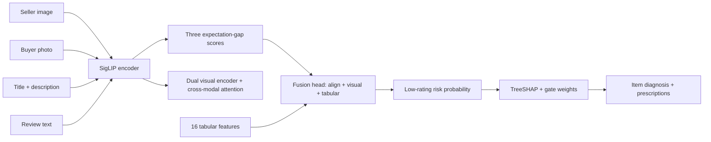

# Architecture

## Pipeline

## Module responsibilities

| Module | Responsibility |
|---|---|
| `scores.py` | SigLIP encoding; Score1/2/3 computation |
| `features.py` | 16-dim tabular features (sentiment, price rank, interactions) |
| `models.py` | DeepFMP-DG networks (visual / visual+tab / direct / softmax-gate) |
| `train.py` | Fixed-seed training, early stopping, 5-fold CV |
| `evaluate.py` | AUC/AP/F1/Precision/Recall/Accuracy |
| `explain.py` | TreeSHAP attribution; gate weights |
| `diagnose.py` | Five-level risk grading; root causes; prescriptions |
| `infer.py` | Single-item end-to-end pipeline → JSON |
| `cli.py` / `demo_app.py` | CLI and Gradio interfaces |

## Data flow (single prediction)

1. Encode seller image, buyer image, merchant text, review text with SigLIP.
2. Compute Score1/2/3 (cosine similarities in the shared space).
3. Build 16 tabular features from review text, title, price, and deltas.
4. Forward through the direct-fusion network → risk probability.
5. TreeSHAP on the tabular model → top-5 feature attributions.
6. Rule-based diagnosis → five-level grade + causes + prioritized prescriptions.
