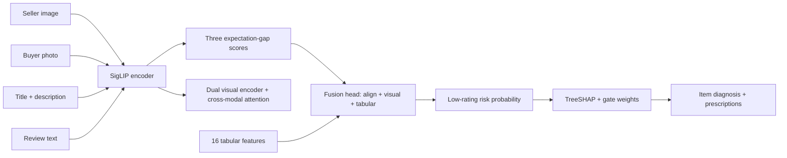

# DeepFMP-DG 开源仓库实现计划

> **For agentic workers:** REQUIRED SUB-SKILL: Use superpowers:subagent-driven-development (recommended) or superpowers:executing-plans to implement this plan task-by-task. Steps use checkbox (`- [ ]`) syntax for tracking.

**Goal:** 把竞赛项目 DeepFMP-DG 重构为一个可直接发布到 GitHub 的中性开源仓库：可安装 Python 包 + CLI + Gradio Demo + 单元测试 + CI + 双语文档 + 小份样例数据。

**Architecture:** 核心逻辑模块化为 `src/deepfmp_dg/`（scores / features / models / train / evaluate / explain / diagnose / infer / cli），对外通过 CLI 与 Gradio Demo 暴露统一 JSON 接口；样例数据与小型训练产物入库，全量数据由脚本说明获取。

**Tech Stack:** Python >=3.10, PyTorch, HuggingFace Transformers (SigLIP), scikit-learn, SHAP, pandas / NumPy, Gradio, pytest, ruff, GitHub Actions。

## Global Constraints

- 仓库任何用户可见内容（README、文档、代码注释、脚本输出）不得出现“比赛/案例大赛/论文初稿/求职/作品集/招聘/面试”等字样。
- README 必须中英双语：`README.md`（英文）+ `README.zh-CN.md`（中文）。
- README/docs 必须包含对 DeepFMP 论文（Zhang, Ji & Cai, Applied Sciences 15(8):4591, 2025）、SigLIP、Amazon Reviews 2023 的引用说明，并声明“扩展实现，非官方代码”。
- 样例数据可包含少量真实商品图，必须注明 demo-only。
- 全部实验固定 seed=42（`set_seed(42)` 在训练入口强制调用）。
- 单文件 >50MB 不入库；.gitignore 排除大文件、图片（除 `data/sample/images/`）、虚拟环境。
- 包名 `deepfmp_dg`，CLI 入口 `deepfmp-dg`。
- 依赖上界：`torch>=2.0`, `transformers>=4.40`, `scikit-learn>=1.3`, `pandas>=2.0`, `numpy>=1.24`, `shap>=0.44`, `gradio>=4.0`, `pytest>=7`, `ruff>=0.4`。
- 代码风格：ruff 默认规则；所有函数有类型标注。

## File Structure

```
deepfmp-dg/
├── README.md / README.zh-CN.md
├── LICENSE (MIT)
├── pyproject.toml
├── .gitignore
├── .github/workflows/ci.yml
├── src/deepfmp_dg/
│   ├── __init__.py
│   ├── scores.py
│   ├── features.py
│   ├── models.py
│   ├── evaluate.py
│   ├── train.py
│   ├── explain.py
│   ├── diagnose.py
│   ├── infer.py
│   └── cli.py
├── demo/app.py
├── examples/demo.ipynb
├── data/sample/
│   ├── modeling_sample.csv
│   ├── embeddings_sample.npz
│   ├── images/seller/*.jpg
│   ├── images/buyer/*.jpg
│   └── models/{deepfmp_direct.pt, rf.joblib, scaler.joblib, feature_names.json}
├── scripts/
│   ├── build_sample_data.py
│   ├── prepare_full_data.py
│   └── reproduce_full_experiments.py
├── research/README.md
├── tests/
│   ├── test_scores.py
│   ├── test_features.py
│   ├── test_models.py
│   ├── test_evaluate.py
│   ├── test_train.py
│   ├── test_explain.py
│   ├── test_diagnose.py
│   └── test_cli.py
└── docs/
    ├── architecture.md
    └── model-card.md
```

---

### Task 1: 仓库脚手架（pyproject / .gitignore / LICENSE / 包骨架）

**Files:**
- Create: `pyproject.toml`
- Create: `.gitignore`
- Create: `LICENSE`
- Create: `src/deepfmp_dg/__init__.py`
- Create: `src/deepfmp_dg/cli.py`（占位，Task 10 替换为完整实现）
- Test: `tests/test_package.py`

**Interfaces:**
- Produces: 可 `pip install -e .` 的包，`import deepfmp_dg` 可用，`deepfmp-dg` 命令可执行（占位输出）。

- [ ] **Step 1: 写失败测试**

`tests/test_package.py`:
```python
import deepfmp_dg


def test_version():
    assert deepfmp_dg.__version__ == "0.1.0"
```

- [ ] **Step 2: 运行测试确认失败**

Run: `pytest tests/test_package.py -v`
Expected: FAIL（`ModuleNotFoundError: No module named 'deepfmp_dg'`）

- [ ] **Step 3: 创建脚手架文件**

`pyproject.toml`:
```toml
[build-system]
requires = ["setuptools>=68"]
build-backend = "setuptools.build_meta"

[project]
name = "deepfmp-dg"
version = "0.1.0"
description = "Multimodal expectation-gap diagnosis for e-commerce"
readme = "README.md"
requires-python = ">=3.10"
license = { text = "MIT" }
authors = [{ name = "DeepFMP-DG Contributors" }]
dependencies = [
  "numpy>=1.24",
  "pandas>=2.0",
  "torch>=2.0",
  "transformers>=4.40",
  "accelerate>=0.27",
  "Pillow>=10.0",
  "scikit-learn>=1.3",
  "shap>=0.44",
  "gradio>=4.0",
  "matplotlib>=3.7",
]

[project.optional-dependencies]
dev = ["pytest>=7", "ruff>=0.4"]

[project.scripts]
deepfmp-dg = "deepfmp_dg.cli:main"

[tool.setuptools.packages.find]
where = ["src"]

[tool.ruff]
line-length = 120
target-version = "py310"
```

`.gitignore`:
```gitignore
__pycache__/
*.py[cod]
.venv/
venv/
*.egg-info/
.pytest_cache/
.ruff_cache/
build/
dist/
.ipynb_checkpoints/
.DS_Store
outputs/
data/raw/
data/processed/
models/
!data/sample/models/
!data/sample/models/**
*.pt.tmp
**/*.jpg
!data/sample/images/**
```

`LICENSE`:
```
MIT License

Copyright (c) 2026 DeepFMP-DG Contributors

Permission is hereby granted, free of charge, to any person obtaining a copy
of this software and associated documentation files (the "Software"), to deal
in the Software without restriction, including without limitation the rights
to use, copy, modify, merge, publish, distribute, sublicense, and/or sell
copies of the Software, and to permit persons to whom the Software is
furnished to do so, subject to the following conditions:

The above copyright notice and this permission notice shall be included in all
copies or substantial portions of the Software.

THE SOFTWARE IS PROVIDED "AS IS", WITHOUT WARRANTY OF ANY KIND, EXPRESS OR
IMPLIED, INCLUDING BUT NOT LIMITED TO THE WARRANTIES OF MERCHANTABILITY,
FITNESS FOR A PARTICULAR PURPOSE AND NONINFRINGEMENT. IN NO EVENT SHALL THE
AUTHORS OR COPYRIGHT HOLDERS BE LIABLE FOR ANY CLAIM, DAMAGES OR OTHER
LIABILITY, WHETHER IN AN ACTION OF CONTRACT, TORT OR OTHERWISE, ARISING FROM,
OUT OF OR IN CONNECTION WITH THE SOFTWARE OR THE USE OR OTHER DEALINGS IN THE
SOFTWARE.
```

`src/deepfmp_dg/__init__.py`:
```python
"""DeepFMP-DG: multimodal expectation-gap diagnosis for e-commerce."""

__version__ = "0.1.0"
```

`src/deepfmp_dg/cli.py`（占位，Task 10 替换）:
```python
"""Command-line entry point (placeholder)."""


def main() -> None:
    print("deepfmp-dg: CLI coming in a later task")
```

- [ ] **Step 4: 安装并运行测试确认通过**

Run: `pip install -e ".[dev]"`
Run: `pytest tests/test_package.py -v`
Expected: PASS（1 passed）
Run: `deepfmp-dg`
Expected: `deepfmp-dg: CLI coming in a later task`

- [ ] **Step 5: 提交**

```bash
git add pyproject.toml .gitignore LICENSE src tests
git commit -m "chore: scaffold installable package"
```

---

### Task 2: scores 模块（SigLIP 编码 + 三维预期差）

**Files:**
- Create: `src/deepfmp_dg/scores.py`
- Test: `tests/test_scores.py`

**Interfaces:**
- Consumes: 无（仅第三方库）。
- Produces:
  - `l2_normalize(x: np.ndarray) -> np.ndarray`
  - `class SigLIPEncoder(model_id="google/siglip-base-patch16-224", device=None)`，方法 `encode_image(path) -> np.ndarray (768,)`、`encode_text(text) -> np.ndarray (768,)`
  - `build_merchant_text(title, description) -> Optional[str]`
  - `clean_review_text(text) -> Optional[str]`
  - `compute_alignment_features(seller_emb, buyer_emb, merchant_emb, review_emb) -> np.ndarray (N,3) float32`
  - `pair_scores(seller_emb, buyer_emb, merchant_emb, review_emb) -> dict{score1,score2,score3}`

- [ ] **Step 1: 写失败测试**

`tests/test_scores.py`:
```python
import numpy as np
import pytest

from deepfmp_dg.scores import (
    build_merchant_text,
    clean_review_text,
    compute_alignment_features,
    l2_normalize,
    pair_scores,
)


def test_l2_normalize_has_unit_norm():
    x = np.array([[3.0, 4.0], [1.0, 0.0]])
    y = l2_normalize(x)
    np.testing.assert_allclose(np.linalg.norm(y, axis=1), [1.0, 1.0], atol=1e-6)


def test_zero_vector_does_not_nan():
    y = l2_normalize(np.zeros((1, 4)))
    assert np.all(np.isfinite(y))


def test_compute_alignment_features_shape_and_range():
    rng = np.random.default_rng(0)
    n = 5
    seller = rng.normal(size=(n, 8))
    buyer = rng.normal(size=(n, 8))
    merchant = rng.normal(size=(n, 8))
    review = rng.normal(size=(n, 8))
    feats = compute_alignment_features(seller, buyer, merchant, review)
    assert feats.shape == (n, 3)
    assert feats.dtype == np.float32
    assert np.all(feats >= -1.0 - 1e-5) and np.all(feats <= 1.0 + 1e-5)


def test_pair_scores_matches_compute_alignment_features():
    rng = np.random.default_rng(1)
    s = rng.normal(size=8)
    b = rng.normal(size=8)
    m = rng.normal(size=8)
    r = rng.normal(size=8)
    scores = pair_scores(s, b, m, r)
    feats = compute_alignment_features(
        s.reshape(1, -1), b.reshape(1, -1), m.reshape(1, -1), r.reshape(1, -1)
    )[0]
    assert scores["score1"] == pytest.approx(feats[0])
    assert scores["score2"] == pytest.approx(feats[1])
    assert scores["score3"] == pytest.approx(feats[2])


def test_build_merchant_text_handles_empty_description():
    assert build_merchant_text("Great Dress", "[]") == "Great Dress"
    assert build_merchant_text("Great Dress", "Nice fabric") == "Great Dress. Nice fabric"
    assert build_merchant_text(None, "Nice fabric") == "Nice fabric"
    assert build_merchant_text(None, None) is None


def test_clean_review_text():
    assert clean_review_text("Hi") is None
    assert clean_review_text("&#34;hi&#34; there") == '"hi" there'
```

- [ ] **Step 2: 运行测试确认失败**

Run: `pytest tests/test_scores.py -v`
Expected: FAIL（`ModuleNotFoundError: No module named 'deepfmp_dg.scores'`）

- [ ] **Step 3: 实现 scores.py**

`src/deepfmp_dg/scores.py`:
```python
"""SigLIP encoders and the three expectation-gap scores.

Score1 (image-image): seller display image vs buyer real photo.
Score2 (text-image): merchant description vs buyer real photo.
Score3 (text-text): merchant description vs buyer review text.
"""
from __future__ import annotations

from pathlib import Path
from typing import Optional, Union

import numpy as np
import torch
from PIL import Image
from transformers import AutoImageProcessor, AutoModel, AutoTokenizer

SIGLIP_MODEL_ID = "google/siglip-base-patch16-224"
EMBEDDING_DIM = 768

PathLike = Union[str, Path]


def l2_normalize(x: np.ndarray) -> np.ndarray:
    """Row-wise L2 normalization with a numerical floor."""
    return x / np.maximum(np.linalg.norm(x, axis=-1, keepdims=True), 1e-12)


def _extract_embedding(outputs) -> np.ndarray:
    if hasattr(outputs, "pooler_output") and outputs.pooler_output is not None:
        vec = outputs.pooler_output
    elif hasattr(outputs, "image_embeds") and outputs.image_embeds is not None:
        vec = outputs.image_embeds
    elif hasattr(outputs, "text_embeds") and outputs.text_embeds is not None:
        vec = outputs.text_embeds
    elif hasattr(outputs, "last_hidden_state"):
        vec = outputs.last_hidden_state.mean(dim=1)
    else:
        raise ValueError("Unsupported model output type")
    return np.asarray(vec.detach().cpu().numpy()).reshape(-1)


class SigLIPEncoder:
    """Lazy-loads the SigLIP model and encodes images and short texts."""

    def __init__(self, model_id: str = SIGLIP_MODEL_ID, device: Optional[str] = None) -> None:
        self.model_id = model_id
        self.device = device or ("cuda" if torch.cuda.is_available() else "cpu")
        self._image_processor = None
        self._tokenizer = None
        self._model = None

    def _ensure_loaded(self) -> None:
        if self._model is None:
            self._image_processor = AutoImageProcessor.from_pretrained(self.model_id)
            self._tokenizer = AutoTokenizer.from_pretrained(self.model_id)
            self._model = AutoModel.from_pretrained(self.model_id).to(self.device)
            self._model.eval()

    def encode_image(self, path: PathLike) -> np.ndarray:
        self._ensure_loaded()
        image = Image.open(path).convert("RGB")
        inputs = self._image_processor(images=image, return_tensors="pt").to(self.device)
        with torch.no_grad():
            outputs = (
                self._model.get_image_features(**inputs)
                if hasattr(self._model, "get_image_features")
                else self._model(**inputs)
            )
        return _extract_embedding(outputs)

    def encode_text(self, text: str) -> np.ndarray:
        self._ensure_loaded()
        inputs = self._tokenizer(
            text=text, return_tensors="pt", padding=True, truncation=True, max_length=64
        ).to(self.device)
        with torch.no_grad():
            outputs = (
                self._model.get_text_features(**inputs)
                if hasattr(self._model, "get_text_features")
                else self._model(**inputs)
            )
        return _extract_embedding(outputs)


def build_merchant_text(title: Optional[str], description: Optional[str]) -> Optional[str]:
    title_txt = str(title or "").strip()
    desc_txt = str(description or "").strip()
    if desc_txt in ("[]", "", "nan", "None"):
        return title_txt or None
    return f"{title_txt}. {desc_txt}" if title_txt else desc_txt


def clean_review_text(text: Optional[str]) -> Optional[str]:
    if not isinstance(text, str) or len(text.strip()) < 5:
        return None
    return text.replace("&#34;", '"').replace("&amp;", "&").strip()[:512]


def compute_alignment_features(
    seller_emb: np.ndarray,
    buyer_emb: np.ndarray,
    merchant_emb: np.ndarray,
    review_emb: np.ndarray,
) -> np.ndarray:
    """Return an (N, 3) array of [score1, score2, score3] cosine similarities."""
    s = l2_normalize(seller_emb)
    b = l2_normalize(buyer_emb)
    m = l2_normalize(merchant_emb)
    r = l2_normalize(review_emb)
    score1 = np.sum(s * b, axis=1, keepdims=True)
    score2 = np.sum(m * b, axis=1, keepdims=True)
    score3 = np.sum(m * r, axis=1, keepdims=True)
    return np.hstack([score1, score2, score3]).astype(np.float32)


def pair_scores(
    seller_emb: np.ndarray,
    buyer_emb: np.ndarray,
    merchant_emb: np.ndarray,
    review_emb: np.ndarray,
) -> dict:
    """Single-vector convenience wrapper returning named scores."""
    feats = compute_alignment_features(
        seller_emb.reshape(1, -1),
        buyer_emb.reshape(1, -1),
        merchant_emb.reshape(1, -1),
        review_emb.reshape(1, -1),
    )[0]
    return {"score1": float(feats[0]), "score2": float(feats[1]), "score3": float(feats[2])}
```

- [ ] **Step 4: 运行测试确认通过**

Run: `pytest tests/test_scores.py -v`
Expected: PASS（5 passed）

- [ ] **Step 5: 提交**

```bash
git add src/deepfmp_dg/scores.py tests/test_scores.py
git commit -m "feat: add SigLIP encoders and expectation-gap scores"
```

### Task 3: features 模块（16 维表格特征）

**Files:**
- Create: `src/deepfmp_dg/features.py`
- Test: `tests/test_features.py`

**Interfaces:**
- Consumes: 无。
- Produces:
  - `NEGATIVE_WORDS`, `POSITIVE_WORDS`, `FEATURE_COLUMNS: list[str]`（16 项）
  - `extract_text_features(text) -> dict`
  - `extract_title_features(title) -> dict`
  - `minmax_rank(series: pd.Series) -> pd.Series`
  - `build_features(df: pd.DataFrame, image_root: Optional[Path] = None) -> pd.DataFrame`
  - `select_features(df: pd.DataFrame, fill_value: float = 0.0) -> np.ndarray (N,16)`

- [ ] **Step 1: 写失败测试**

`tests/test_features.py`:
```python
import numpy as np
import pandas as pd

from deepfmp_dg.features import (
    FEATURE_COLUMNS,
    build_features,
    extract_text_features,
    minmax_rank,
    select_features,
)


def test_extract_text_features_basic():
    f = extract_text_features("Great quality! Not worth it.")
    assert f["review_pos_word_count"] == 1
    assert f["review_neg_word_count"] == 1
    assert f["review_sentiment_diff"] == 0
    assert f["review_exclamation_count"] == 1


def test_extract_text_features_non_string():
    f = extract_text_features(None)
    assert f["review_word_count"] == 0
    assert f["review_sentiment_diff"] == 0


def test_minmax_rank_range():
    s = pd.Series([10.0, 20.0, 30.0])
    r = minmax_rank(s)
    assert r.min() > 0 and r.max() <= 1.0
    assert len(r) == 3


def test_build_features_creates_all_columns():
    df = pd.DataFrame(
        {
            "review_text": ["Great dress, love it!", "Terrible quality, broke in a day"],
            "title": ["Summer Dress", "Winter Coat"],
            "delta_cosine": [0.3, 0.7],
            "delta_euclidean": [5.0, 9.0],
            "price": [25.0, 80.0],
        }
    )
    out = build_features(df)
    for col in FEATURE_COLUMNS:
        assert col in out.columns
    assert out["delta_x_price_rank"].iloc[0] == 0.3 * out["P_rank"].iloc[0]


def test_select_features_fills_missing():
    df = pd.DataFrame(
        {
            "review_text": ["ok"],
            "title": ["T"],
            "delta_cosine": [0.2],
            "delta_euclidean": [1.0],
            "price": [10.0],
        }
    )
    out = build_features(df)
    X = select_features(out)
    assert X.shape == (1, len(FEATURE_COLUMNS))
    assert np.all(np.isfinite(X))
```

- [ ] **Step 2: 运行测试确认失败**

Run: `pytest tests/test_features.py -v`
Expected: FAIL（`ModuleNotFoundError: No module named 'deepfmp_dg.features'`）

- [ ] **Step 3: 实现 features.py**

`src/deepfmp_dg/features.py`:
```python
"""Tabular feature engineering for the expectation-gap model."""
from __future__ import annotations

import re
from pathlib import Path
from typing import Optional, Union

import numpy as np
import pandas as pd

NEGATIVE_WORDS = {
    "not", "no", "never", "worst", "terrible", "horrible", "awful",
    "bad", "poor", "ugly", "disappointing", "disappointed", "cheap",
    "flimsy", "broken", "defective", "waste", "return", "refund",
    "trash", "garbage", "scam", "fake", "overpriced",
}

POSITIVE_WORDS = {
    "great", "excellent", "amazing", "perfect", "love", "beautiful",
    "exceeded", "recommend", "comfortable", "sturdy", "quality",
    "happy", "pleased", "wonderful", "fantastic", "awesome", "nice",
    "best", "outstanding", "superb", "impressed",
}

DELTA_FEATURES = ["delta_cosine", "delta_euclidean"]
PRICE_FEATURES = ["P_rank", "delta_x_price_rank"]
TEXT_FEATURES = [
    "review_sentiment_diff", "review_neg_word_count", "review_pos_word_count",
    "review_exclamation_count", "review_word_count", "review_upper_ratio",
    "title_word_count", "delta_x_review_length", "delta_x_negation",
    "log_review_length",
]
IMG_META_FEATURES = ["img_kb_diff", "img_kb_ratio"]
FEATURE_COLUMNS = DELTA_FEATURES + PRICE_FEATURES + TEXT_FEATURES + IMG_META_FEATURES


def extract_text_features(text: object) -> dict:
    """Lexical review features used by the tabular branch."""
    if not isinstance(text, str):
        return {
            "review_length": 0,
            "review_word_count": 0,
            "review_exclamation_count": 0,
            "review_question_count": 0,
            "review_upper_ratio": 0.0,
            "review_neg_word_count": 0,
            "review_pos_word_count": 0,
            "review_sentiment_diff": 0,
        }
    clean = re.sub(r"<[^>]+>", " ", text)
    clean = clean.replace("&#34;", '"').replace("&amp;", "&")
    words = clean.lower().split()
    word_set = set(words)
    return {
        "review_length": len(clean),
        "review_word_count": len(words),
        "review_exclamation_count": clean.count("!"),
        "review_question_count": clean.count("?"),
        "review_upper_ratio": sum(1 for c in clean if c.isupper()) / max(len(clean), 1),
        "review_neg_word_count": len(word_set & NEGATIVE_WORDS),
        "review_pos_word_count": len(word_set & POSITIVE_WORDS),
        "review_sentiment_diff": len(word_set & POSITIVE_WORDS) - len(word_set & NEGATIVE_WORDS),
    }


def extract_title_features(title: object) -> dict:
    if not isinstance(title, str):
        return {"title_length": 0, "title_word_count": 0}
    return {"title_length": len(title), "title_word_count": len(title.split())}


def minmax_rank(series: pd.Series) -> pd.Series:
    """Percentile-style rank in [0, 1], robust for small samples."""
    numeric = pd.to_numeric(series, errors="coerce")
    if numeric.notna().sum() <= 1:
        return pd.Series(np.nan, index=series.index)
    return numeric.rank(method="average", pct=True)


def img_size_kb(path_value: object, image_root: Optional[Path]) -> float:
    if not isinstance(path_value, str) or image_root is None:
        return np.nan
    p = image_root / path_value
    if p.exists():
        return p.stat().st_size / 1024.0
    return np.nan


def build_features(df: pd.DataFrame, image_root: Optional[Path] = None) -> pd.DataFrame:
    """Add all 16 modeling features to a copy of ``df``.

    Required input columns: review_text, title, delta_cosine, delta_euclidean, price.
    Optional: seller_image_path, buyer_image_path (for image-size features).
    """
    out = df.copy()

    text_feats = out["review_text"].apply(extract_text_features).apply(pd.Series)
    title_feats = out["title"].apply(extract_title_features).apply(pd.Series)
    out = pd.concat([out, text_feats, title_feats], axis=1)

    if "P_rank" not in out.columns:
        out["P_rank"] = minmax_rank(out["price"])

    if "seller_image_path" in out.columns:
        out["seller_img_kb"] = out["seller_image_path"].apply(
            lambda v: img_size_kb(v, image_root)
        )
        out["buyer_img_kb"] = out["buyer_image_path"].apply(
            lambda v: img_size_kb(v, image_root)
        )
        out["img_kb_diff"] = out["seller_img_kb"] - out["buyer_img_kb"]
        out["img_kb_ratio"] = out["seller_img_kb"] / out["buyer_img_kb"].replace(0, np.nan)
    else:
        out["img_kb_diff"] = np.nan
        out["img_kb_ratio"] = np.nan

    out["delta_x_review_length"] = out["delta_cosine"] * out["review_word_count"]
    out["delta_x_negation"] = out["delta_cosine"] * out["review_neg_word_count"]
    out["delta_x_price_rank"] = out["delta_cosine"] * out["P_rank"]
    out["log_review_length"] = np.log1p(out["review_word_count"])

    return out


def select_features(df: pd.DataFrame, fill_value: float = 0.0) -> np.ndarray:
    """Return the (N, 16) feature matrix, replacing missing values."""
    missing = [c for c in FEATURE_COLUMNS if c not in df.columns]
    if missing:
        raise ValueError(f"Missing feature columns: {missing}")
    return df[FEATURE_COLUMNS].fillna(fill_value).values.astype(np.float32)
```

- [ ] **Step 4: 运行测试确认通过**

Run: `pytest tests/test_features.py -v`
Expected: PASS（5 passed）

- [ ] **Step 5: 提交**

```bash
git add src/deepfmp_dg/features.py tests/test_features.py
git commit -m "feat: add tabular feature engineering"
```

---

### Task 4: models 模块（DeepFMP-DG 网络）

**Files:**
- Create: `src/deepfmp_dg/models.py`
- Test: `tests/test_models.py`

**Interfaces:**
- Consumes: 无。
- Produces:
  - `class CrossModalAttention(nn.Module)`：`forward(x_a, x_b) -> Tensor(B,D)`
  - `class DualEncoderWithAttention(nn.Module)`：`encode(emb_a, emb_b) -> Tensor(B, out_dim)`，`out_dim = proj_dim*2 + 128 + 64`
  - `class VisualOnlyNetwork(seller_img, buyer_img) -> Tensor(B,2)`
  - `class VisualTabNetwork(seller_img, buyer_img, tabular) -> Tensor(B,2)`
  - `class AlignDirectNetwork(seller_img, buyer_img, align_feats, tabular) -> Tensor(B,2)`
  - `class SoftmaxGateNetwork(...)` + `get_gate_weights(align_feats) -> Tensor(B,3)`
  - `MODEL_TYPES: dict[str, type]`、`create_model(model_type, emb_dim=768, n_tabular=16, n_align=3, dropout=0.4)`

- [ ] **Step 1: 写失败测试**

`tests/test_models.py`:
```python
import pytest
import torch

from deepfmp_dg.models import MODEL_TYPES, create_model


@pytest.mark.parametrize("model_type", list(MODEL_TYPES.keys()))
def test_forward_shapes(model_type):
    torch.manual_seed(0)
    model = create_model(model_type, emb_dim=8, n_tabular=4, n_align=3)
    b = 2
    seller = torch.randn(b, 8)
    buyer = torch.randn(b, 8)
    tab = torch.randn(b, 4)
    align = torch.randn(b, 3)
    if model_type == "visual":
        logits = model(seller, buyer)
    elif model_type == "visual_tab":
        logits = model(seller, buyer, tab)
    else:
        logits = model(seller, buyer, align, tab)
    assert logits.shape == (b, 2)


def test_softmax_gate_weights_sum_to_one():
    torch.manual_seed(0)
    model = create_model("softmax_gate", emb_dim=8, n_tabular=4, n_align=3)
    align = torch.randn(5, 3)
    w = model.get_gate_weights(align)
    assert w.shape == (5, 3)
    torch.testing.assert_close(w.sum(dim=-1), torch.ones(5), atol=1e-5, rtol=1e-5)


def test_create_model_unknown_type():
    with pytest.raises(ValueError):
        create_model("nope")
```

- [ ] **Step 2: 运行测试确认失败**

Run: `pytest tests/test_models.py -v`
Expected: FAIL（`ModuleNotFoundError: No module named 'deepfmp_dg.models'`）

- [ ] **Step 3: 实现 models.py**

`src/deepfmp_dg/models.py`:
```python
"""DeepFMP-DG network definitions.

The architecture fuses a dual visual encoder, three expectation-gap
alignment scores, and tabular features through attention and gating.
"""
from __future__ import annotations

import torch
import torch.nn as nn
import torch.nn.functional as F


class CrossModalAttention(nn.Module):
    def __init__(self, dim: int, num_heads: int = 4, dropout: float = 0.1) -> None:
        super().__init__()
        self.num_heads = num_heads
        self.head_dim = dim // num_heads
        self.scale = self.head_dim ** -0.5
        self.q_proj = nn.Linear(dim, dim)
        self.k_proj = nn.Linear(dim, dim)
        self.v_proj = nn.Linear(dim, dim)
        self.out_proj = nn.Linear(dim, dim)
        self.dropout = nn.Dropout(dropout)
        self.norm1 = nn.LayerNorm(dim)

    def forward(self, x_a: torch.Tensor, x_b: torch.Tensor) -> torch.Tensor:
        b, d = x_a.shape
        q = self.q_proj(x_a).view(b, self.num_heads, self.head_dim)
        k = self.k_proj(x_b).view(b, self.num_heads, self.head_dim)
        v = self.v_proj(x_b).view(b, self.num_heads, self.head_dim)
        attn = (q * k).sum(dim=-1) * self.scale
        attn = F.softmax(attn, dim=-1)
        attn = self.dropout(attn)
        out = (attn.unsqueeze(-1) * v).reshape(b, d)
        out = self.out_proj(out)
        return self.norm1(x_a + out)


class DualEncoderWithAttention(nn.Module):
    def __init__(self, emb_dim: int = 768, proj_dim: int = 128, dropout: float = 0.4) -> None:
        super().__init__()
        self.encoder_a = nn.Sequential(
            nn.Linear(emb_dim, 256), nn.BatchNorm1d(256), nn.GELU(), nn.Dropout(dropout),
            nn.Linear(256, proj_dim), nn.BatchNorm1d(proj_dim), nn.GELU(),
        )
        self.encoder_b = nn.Sequential(
            nn.Linear(emb_dim, 256), nn.BatchNorm1d(256), nn.GELU(), nn.Dropout(dropout),
            nn.Linear(256, proj_dim), nn.BatchNorm1d(proj_dim), nn.GELU(),
        )
        self.cross_attn_ab = CrossModalAttention(proj_dim, num_heads=4, dropout=dropout)
        self.cross_attn_ba = CrossModalAttention(proj_dim, num_heads=4, dropout=dropout)
        self.diff_proj = nn.Sequential(
            nn.Linear(emb_dim, 128), nn.BatchNorm1d(128), nn.GELU(), nn.Dropout(dropout),
        )
        self.hadamard_proj = nn.Sequential(
            nn.Linear(proj_dim, 64), nn.BatchNorm1d(64), nn.GELU(),
        )
        self.out_dim = proj_dim * 2 + 128 + 64

    def encode(self, emb_a: torch.Tensor, emb_b: torch.Tensor) -> torch.Tensor:
        enc_a = self.encoder_a(emb_a)
        enc_b = self.encoder_b(emb_b)
        enc_a_attended = self.cross_attn_ab(enc_a, enc_b)
        enc_b_attended = self.cross_attn_ba(enc_b, enc_a)
        diff = self.diff_proj(emb_a - emb_b)
        hadamard = self.hadamard_proj(enc_a_attended * enc_b_attended)
        return torch.cat([enc_a_attended, enc_b_attended, diff, hadamard], dim=-1)


class VisualOnlyNetwork(nn.Module):
    def __init__(self, emb_dim: int = 768, proj_dim: int = 128, dropout: float = 0.4) -> None:
        super().__init__()
        self.visual_net = DualEncoderWithAttention(emb_dim, proj_dim, dropout)
        fused_dim = self.visual_net.out_dim
        self.head = nn.Sequential(
            nn.Linear(fused_dim, proj_dim), nn.BatchNorm1d(proj_dim), nn.GELU(), nn.Dropout(dropout),
            nn.Linear(proj_dim, proj_dim // 2), nn.GELU(), nn.Dropout(dropout * 0.5),
            nn.Linear(proj_dim // 2, 2),
        )

    def forward(self, seller_img: torch.Tensor, buyer_img: torch.Tensor) -> torch.Tensor:
        return self.head(self.visual_net.encode(seller_img, buyer_img))


class VisualTabNetwork(nn.Module):
    def __init__(
        self, emb_dim: int = 768, n_tabular: int = 16, proj_dim: int = 128, dropout: float = 0.4
    ) -> None:
        super().__init__()
        self.visual_net = DualEncoderWithAttention(emb_dim, proj_dim, dropout)
        self.tabular_proj = nn.Sequential(
            nn.Linear(n_tabular, proj_dim), nn.BatchNorm1d(proj_dim), nn.GELU(), nn.Dropout(dropout),
        )
        fused_dim = self.visual_net.out_dim + proj_dim
        self.gate = nn.Sequential(
            nn.Linear(fused_dim, proj_dim), nn.Tanh(), nn.Linear(proj_dim, fused_dim), nn.Sigmoid(),
        )
        self.head = nn.Sequential(
            nn.Linear(fused_dim, proj_dim), nn.BatchNorm1d(proj_dim), nn.GELU(), nn.Dropout(dropout),
            nn.Linear(proj_dim, proj_dim // 2), nn.GELU(), nn.Dropout(dropout * 0.5),
            nn.Linear(proj_dim // 2, 2),
        )

    def forward(self, seller_img: torch.Tensor, buyer_img: torch.Tensor, tabular: torch.Tensor) -> torch.Tensor:
        visual_feat = self.visual_net.encode(seller_img, buyer_img)
        tab_feat = self.tabular_proj(tabular)
        combined = torch.cat([visual_feat, tab_feat], dim=-1)
        gated = combined * self.gate(combined)
        return self.head(gated)


class AlignDirectNetwork(nn.Module):
    def __init__(
        self, emb_dim: int = 768, n_tabular: int = 16, n_align: int = 3,
        proj_dim: int = 128, dropout: float = 0.4,
    ) -> None:
        super().__init__()
        self.visual_net = DualEncoderWithAttention(emb_dim, proj_dim, dropout)
        self.align_proj = nn.Sequential(
            nn.Linear(n_align, 32), nn.BatchNorm1d(32), nn.GELU(), nn.Dropout(dropout),
        )
        self.tabular_proj = nn.Sequential(
            nn.Linear(n_tabular, proj_dim), nn.BatchNorm1d(proj_dim), nn.GELU(), nn.Dropout(dropout),
        )
        fused_dim = self.visual_net.out_dim + 32 + proj_dim
        self.fusion_attn = nn.Sequential(
            nn.Linear(fused_dim, proj_dim), nn.Tanh(), nn.Linear(proj_dim, fused_dim), nn.Sigmoid(),
        )
        self.head = nn.Sequential(
            nn.Linear(fused_dim, proj_dim), nn.BatchNorm1d(proj_dim), nn.GELU(), nn.Dropout(dropout),
            nn.Linear(proj_dim, proj_dim // 2), nn.GELU(), nn.Dropout(dropout * 0.5),
            nn.Linear(proj_dim // 2, 2),
        )

    def forward(
        self, seller_img: torch.Tensor, buyer_img: torch.Tensor,
        align_feats: torch.Tensor, tabular: torch.Tensor,
    ) -> torch.Tensor:
        visual_feat = self.visual_net.encode(seller_img, buyer_img)
        align_feat = self.align_proj(align_feats)
        tab_feat = self.tabular_proj(tabular)
        combined = torch.cat([visual_feat, align_feat, tab_feat], dim=-1)
        fused = combined * self.fusion_attn(combined)
        return self.head(fused)


class SoftmaxGateNetwork(nn.Module):
    def __init__(
        self, emb_dim: int = 768, n_tabular: int = 16, n_align: int = 3,
        proj_dim: int = 128, dropout: float = 0.4,
    ) -> None:
        super().__init__()
        self.visual_net = DualEncoderWithAttention(emb_dim, proj_dim, dropout)
        self.gate_mlp = nn.Sequential(
            nn.Linear(n_align, 16), nn.GELU(),
            nn.Linear(16, n_align),
        )
        self.align_proj = nn.Sequential(
            nn.Linear(n_align, 32), nn.BatchNorm1d(32), nn.GELU(), nn.Dropout(dropout),
        )
        self.tabular_proj = nn.Sequential(
            nn.Linear(n_tabular, proj_dim), nn.BatchNorm1d(proj_dim), nn.GELU(), nn.Dropout(dropout),
        )
        fused_dim = self.visual_net.out_dim + 32 + proj_dim
        self.fusion_attn = nn.Sequential(
            nn.Linear(fused_dim, proj_dim), nn.Tanh(), nn.Linear(proj_dim, fused_dim), nn.Sigmoid(),
        )
        self.head = nn.Sequential(
            nn.Linear(fused_dim, proj_dim), nn.BatchNorm1d(proj_dim), nn.GELU(), nn.Dropout(dropout),
            nn.Linear(proj_dim, proj_dim // 2), nn.GELU(), nn.Dropout(dropout * 0.5),
            nn.Linear(proj_dim // 2, 2),
        )

    def forward(
        self, seller_img: torch.Tensor, buyer_img: torch.Tensor,
        align_feats: torch.Tensor, tabular: torch.Tensor,
    ) -> torch.Tensor:
        visual_feat = self.visual_net.encode(seller_img, buyer_img)
        gate_logits = self.gate_mlp(align_feats)
        gate_weights = F.softmax(gate_logits, dim=-1)
        weighted_feats = align_feats * gate_weights
        align_feat = self.align_proj(weighted_feats)
        tab_feat = self.tabular_proj(tabular)
        combined = torch.cat([visual_feat, align_feat, tab_feat], dim=-1)
        fused = combined * self.fusion_attn(combined)
        return self.head(fused)

    def get_gate_weights(self, align_feats: torch.Tensor) -> torch.Tensor:
        with torch.no_grad():
            gate_logits = self.gate_mlp(align_feats)
            return F.softmax(gate_logits, dim=-1)


MODEL_TYPES = {
    "visual": VisualOnlyNetwork,
    "visual_tab": VisualTabNetwork,
    "direct": AlignDirectNetwork,
    "softmax_gate": SoftmaxGateNetwork,
}


def create_model(
    model_type: str, emb_dim: int = 768, n_tabular: int = 16,
    n_align: int = 3, dropout: float = 0.4,
) -> nn.Module:
    if model_type not in MODEL_TYPES:
        raise ValueError(f"Unknown model_type: {model_type}")
    return MODEL_TYPES[model_type](
        emb_dim=emb_dim, n_tabular=n_tabular, n_align=n_align, dropout=dropout
    )
```

- [ ] **Step 4: 运行测试确认通过**

Run: `pytest tests/test_models.py -v`
Expected: PASS（6 passed：4 个前向 + 门控权重 + 未知类型）

- [ ] **Step 5: 提交**

```bash
git add src/deepfmp_dg/models.py tests/test_models.py
git commit -m "feat: add DeepFMP-DG network definitions"
```

---

### Task 5: evaluate 模块（评估指标）

**Files:**
- Create: `src/deepfmp_dg/evaluate.py`
- Test: `tests/test_evaluate.py`

**Interfaces:**
- Consumes: 无。
- Produces:
  - `safe_auc(y_true: np.ndarray, y_score: np.ndarray) -> float`
  - `safe_ap(y_true: np.ndarray, y_score: np.ndarray) -> float`
  - `compute_metrics(y_true, y_score, threshold=0.5) -> dict{auc,ap,f1,precision,recall,accuracy}`

- [ ] **Step 1: 写失败测试**

`tests/test_evaluate.py`:
```python
import numpy as np

from deepfmp_dg.evaluate import compute_metrics, safe_ap, safe_auc


def test_safe_auc_known_value():
    y = np.array([0, 0, 1, 1])
    p = np.array([0.1, 0.4, 0.35, 0.8])
    assert safe_auc(y, p) == 0.75


def test_safe_auc_single_class_returns_nan():
    assert np.isnan(safe_auc(np.zeros(4), np.zeros(4)))


def test_safe_ap_single_class_returns_nan():
    assert np.isnan(safe_ap(np.zeros(4), np.zeros(4)))


def test_compute_metrics_keys():
    y = np.array([0, 0, 1, 1])
    p = np.array([0.1, 0.4, 0.35, 0.8])
    m = compute_metrics(y, p)
    for key in ["auc", "ap", "f1", "precision", "recall", "accuracy"]:
        assert key in m
    assert m["auc"] == 0.75
```

- [ ] **Step 2: 运行测试确认失败**

Run: `pytest tests/test_evaluate.py -v`
Expected: FAIL（`ModuleNotFoundError: No module named 'deepfmp_dg.evaluate'`）

- [ ] **Step 3: 实现 evaluate.py**

`src/deepfmp_dg/evaluate.py`:
```python
"""Evaluation metrics for the binary low-rating risk task."""
from __future__ import annotations

import numpy as np
from sklearn.metrics import (
    accuracy_score,
    average_precision_score,
    f1_score,
    precision_score,
    recall_score,
    roc_auc_score,
)


def safe_auc(y_true: np.ndarray, y_score: np.ndarray) -> float:
    if len(np.unique(y_true)) < 2:
        return np.nan
    return float(roc_auc_score(y_true, y_score))


def safe_ap(y_true: np.ndarray, y_score: np.ndarray) -> float:
    if len(np.unique(y_true)) < 2:
        return np.nan
    return float(average_precision_score(y_true, y_score))


def compute_metrics(y_true: np.ndarray, y_score: np.ndarray, threshold: float = 0.5) -> dict:
    pred = (y_score >= threshold).astype(int)
    return {
        "auc": safe_auc(y_true, y_score),
        "ap": safe_ap(y_true, y_score),
        "f1": float(f1_score(y_true, pred, zero_division=0)),
        "precision": float(precision_score(y_true, pred, zero_division=0)),
        "recall": float(recall_score(y_true, pred, zero_division=0)),
        "accuracy": float(accuracy_score(y_true, pred)),
    }
```

- [ ] **Step 4: 运行测试确认通过**

Run: `pytest tests/test_evaluate.py -v`
Expected: PASS（4 passed）

- [ ] **Step 5: 提交**

```bash
git add src/deepfmp_dg/evaluate.py tests/test_evaluate.py
git commit -m "feat: add evaluation metrics"
```

### Task 6: train 模块（固定 seed 训练 + 5 折 CV）

**Files:**
- Create: `src/deepfmp_dg/train.py`
- Test: `tests/test_train.py`

**Interfaces:**
- Consumes: `deepfmp_dg.evaluate.safe_auc/safe_ap`、`deepfmp_dg.models.create_model`。
- Produces:
  - `set_seed(seed=42) -> None`
  - `train_model(model_type, seller_emb, buyer_emb, align_feats, X_tabular, y, train_idx, val_idx, epochs=200, lr=3e-4, weight_decay=5e-4, dropout=0.4, patience=30, n_align=3) -> (prob: np.ndarray, best_auc: float, info: dict, best_state: dict, model: nn.Module)`
  - `run_experiment(model_name, model_type, seller_emb, buyer_emb, align_feats, X_tabular, y, n_splits=5, n_align=3, epochs=200, patience=30) -> dict`
  - `save_checkpoint(model, model_type, path) -> None`、`load_checkpoint(model, path) -> None`

- [ ] **Step 1: 写失败测试**

`tests/test_train.py`:
```python
import numpy as np
import torch

from deepfmp_dg.train import run_experiment, set_seed, train_model


def _make_data(n=64, dim=8):
    rng = np.random.default_rng(42)
    seller = rng.normal(size=(n, dim)).astype(np.float32)
    buyer = rng.normal(size=(n, dim)).astype(np.float32)
    align = rng.uniform(-1, 1, size=(n, 3)).astype(np.float32)
    tab = rng.normal(size=(n, 4)).astype(np.float32)
    y = np.array([0, 1] * (n // 2))
    return seller, buyer, align, tab, y


def test_set_seed_reproducible():
    set_seed(42)
    a = torch.randn(3)
    set_seed(42)
    b = torch.randn(3)
    torch.testing.assert_close(a, b)


def test_train_model_runs_and_returns_prob():
    seller, buyer, align, tab, y = _make_data()
    train_idx = np.arange(48)
    val_idx = np.arange(48, 64)
    prob, best_auc, info, state, model = train_model(
        "direct", seller, buyer, align, tab, y, train_idx, val_idx,
        epochs=3, patience=2,
    )
    assert prob.shape == (16,)
    assert np.all((prob >= 0) & (prob <= 1))
    assert best_auc >= 0.0
    assert state is not None


def test_run_experiment_returns_metrics():
    seller, buyer, align, tab, y = _make_data()
    res = run_experiment(
        "DeepFMP (S1+S2+S3, direct)", "direct",
        seller, buyer, align, tab, y, n_splits=2, epochs=2, patience=1,
    )
    for key in ["model", "n", "positive", "auc_cv", "ap_cv", "f1_cv",
                "precision_cv", "recall_cv", "accuracy_cv", "y", "prob"]:
        assert key in res
    assert res["n"] == 64
```

- [ ] **Step 2: 运行测试确认失败**

Run: `pytest tests/test_train.py -v`
Expected: FAIL（`ModuleNotFoundError: No module named 'deepfmp_dg.train'`）

- [ ] **Step 3: 实现 train.py**

`src/deepfmp_dg/train.py`:
```python
"""Fixed-seed training with early stopping and cross-validation."""
from __future__ import annotations

import random
from pathlib import Path
from typing import Optional

import numpy as np
import torch
import torch.nn as nn
from sklearn.model_selection import StratifiedKFold
from torch.utils.data import DataLoader, TensorDataset

from sklearn.metrics import accuracy_score, f1_score, precision_score, recall_score

from deepfmp_dg.evaluate import safe_ap, safe_auc
from deepfmp_dg.models import create_model

PathLike = str | Path


def set_seed(seed: int = 42) -> None:
    random.seed(seed)
    np.random.seed(seed)
    torch.manual_seed(seed)
    torch.cuda.manual_seed_all(seed)
    torch.backends.cudnn.deterministic = True
    torch.backends.cudnn.benchmark = False


def train_model(
    model_type: str,
    seller_emb: np.ndarray,
    buyer_emb: np.ndarray,
    align_feats: np.ndarray,
    X_tabular: np.ndarray,
    y: np.ndarray,
    train_idx: np.ndarray,
    val_idx: np.ndarray,
    epochs: int = 200,
    lr: float = 3e-4,
    weight_decay: float = 5e-4,
    dropout: float = 0.4,
    patience: int = 30,
    n_align: int = 3,
):
    """Train one model on a fixed split; returns OOF-style probabilities on val_idx."""
    device = torch.device("cuda" if torch.cuda.is_available() else "cpu")
    emb_dim = seller_emb.shape[1]

    s_train = torch.tensor(seller_emb[train_idx], dtype=torch.float32)
    b_train = torch.tensor(buyer_emb[train_idx], dtype=torch.float32)
    a_train = torch.tensor(align_feats[train_idx], dtype=torch.float32)
    tab_train = torch.tensor(X_tabular[train_idx], dtype=torch.float32)
    y_train = torch.tensor(y[train_idx], dtype=torch.long)

    s_val = torch.tensor(seller_emb[val_idx], dtype=torch.float32)
    b_val = torch.tensor(buyer_emb[val_idx], dtype=torch.float32)
    a_val = torch.tensor(align_feats[val_idx], dtype=torch.float32)
    tab_val = torch.tensor(X_tabular[val_idx], dtype=torch.float32)

    pos_w = torch.tensor([(y_train == 0).sum() / max((y_train == 1).sum(), 1)], device=device)
    criterion = nn.CrossEntropyLoss(weight=torch.cat([torch.ones(1), pos_w]).to(device))

    n_tab = X_tabular.shape[1]
    model = create_model(model_type, emb_dim=emb_dim, n_tabular=n_tab, n_align=n_align, dropout=dropout).to(device)

    def build_dataset() -> TensorDataset:
        if model_type == "visual":
            return TensorDataset(s_train, b_train, y_train)
        if model_type == "visual_tab":
            return TensorDataset(s_train, b_train, tab_train, y_train)
        return TensorDataset(s_train, b_train, a_train, tab_train, y_train)

    def train_fwd(batch):
        if model_type == "visual":
            return model(batch[0].to(device), batch[1].to(device))
        if model_type == "visual_tab":
            return model(batch[0].to(device), batch[1].to(device), batch[2].to(device))
        return model(batch[0].to(device), batch[1].to(device), batch[2].to(device), batch[3].to(device))

    def val_fwd():
        if model_type == "visual":
            return model(s_val.to(device), b_val.to(device))
        if model_type == "visual_tab":
            return model(s_val.to(device), b_val.to(device), tab_val.to(device))
        return model(s_val.to(device), b_val.to(device), a_val.to(device), tab_val.to(device))

    optimizer = torch.optim.AdamW(model.parameters(), lr=lr, weight_decay=weight_decay)
    scheduler = torch.optim.lr_scheduler.CosineAnnealingLR(optimizer, T_max=epochs)
    bs = min(64, len(train_idx))
    loader = DataLoader(build_dataset(), batch_size=bs, shuffle=True, drop_last=False)

    best_auc = 0.0
    best_state = None
    best_gate_weights = None
    wait = 0

    for epoch in range(epochs):
        model.train()
        for batch in loader:
            target = batch[-1].to(device)
            logits = train_fwd(batch)
            loss = criterion(logits, target)
            optimizer.zero_grad()
            loss.backward()
            torch.nn.utils.clip_grad_norm_(model.parameters(), 1.0)
            optimizer.step()
        scheduler.step()

        model.eval()
        with torch.no_grad():
            logits = val_fwd()
            prob = torch.softmax(logits, dim=1)[:, 1].cpu().numpy()
            val_auc = safe_auc(y[val_idx], prob)
            if val_auc > best_auc:
                best_auc = val_auc
                best_state = {k: v.cpu().clone() for k, v in model.state_dict().items()}
                if hasattr(model, "get_gate_weights"):
                    best_gate_weights = model.get_gate_weights(a_val.to(device)).cpu().numpy()
                wait = 0
            else:
                wait += 1
                if wait >= patience:
                    break

    if best_state is not None:
        model.load_state_dict(best_state)
    model.eval()
    with torch.no_grad():
        logits = val_fwd()
        prob = torch.softmax(logits, dim=1)[:, 1].cpu().numpy()

    info: dict = {}
    if best_gate_weights is not None:
        info["gate_weights"] = {
            "score1": float(np.mean(best_gate_weights[:, 0])),
            "score2": float(np.mean(best_gate_weights[:, 1])),
            "score3": float(np.mean(best_gate_weights[:, 2])),
        }
    return prob, best_auc, info, best_state, model


def run_experiment(
    model_name: str,
    model_type: str,
    seller_emb: np.ndarray,
    buyer_emb: np.ndarray,
    align_feats: np.ndarray,
    X_tabular: np.ndarray,
    y: np.ndarray,
    n_splits: int = 5,
    n_align: int = 3,
    epochs: int = 200,
    patience: int = 30,
) -> Optional[dict]:
    """Run stratified K-fold CV and return aggregated metrics."""
    min_class = min(np.sum(y == 0), np.sum(y == 1))
    n_splits = min(n_splits, min_class)
    if n_splits < 2 or len(y) < 30:
        return None

    cv = StratifiedKFold(n_splits=n_splits, shuffle=True, random_state=42)
    all_prob = np.zeros(len(y))
    all_infos: list[dict] = []

    for fold, (train_idx, val_idx) in enumerate(cv.split(seller_emb, y)):
        prob, _, info, _, _ = train_model(
            model_type, seller_emb, buyer_emb, align_feats, X_tabular, y,
            train_idx, val_idx, n_align=n_align, epochs=epochs, patience=patience,
        )
        all_prob[val_idx] = prob
        all_infos.append(info)

    pred = (all_prob >= 0.5).astype(int)
    avg_info: dict = {}
    if all_infos and "gate_weights" in all_infos[0]:
        avg_info["gate_weights"] = {}
        for key in all_infos[0]["gate_weights"]:
            avg_info["gate_weights"][key] = float(np.mean(
                [info["gate_weights"][key] for info in all_infos if "gate_weights" in info]
            ))

    return {
        "model": model_name,
        "n": int(len(y)),
        "positive": int(y.sum()),
        "auc_cv": safe_auc(y, all_prob),
        "ap_cv": safe_ap(y, all_prob),
        "f1_cv": float(f1_score(y, pred, zero_division=0)),
        "precision_cv": float(precision_score(y, pred, zero_division=0)),
        "recall_cv": float(recall_score(y, pred, zero_division=0)),
        "accuracy_cv": float(accuracy_score(y, pred)),
        "y": y,
        "prob": all_prob,
        **avg_info,
    }


def save_checkpoint(model: nn.Module, model_type: str, path: PathLike) -> None:
    path = Path(path)
    path.parent.mkdir(parents=True, exist_ok=True)
    torch.save({"model_type": model_type, "state_dict": model.state_dict()}, path)


def load_checkpoint(model: nn.Module, path: PathLike) -> str:
    """Load weights into ``model``; returns the stored model_type."""
    checkpoint = torch.load(path, map_location="cpu")
    model.load_state_dict(checkpoint["state_dict"])
    return checkpoint["model_type"]
```

> 注：`run_experiment` 的 sklearn 指标已改为文件顶部直接 import。

- [ ] **Step 4: 运行测试确认通过**

Run: `pytest tests/test_train.py -v`
Expected: PASS（3 passed，约 10-30 秒）

- [ ] **Step 5: 提交**

```bash
git add src/deepfmp_dg/train.py tests/test_train.py
git commit -m "feat: add fixed-seed CV training"
```

---

### Task 7: explain 模块（TreeSHAP + 门控权重）

**Files:**
- Create: `src/deepfmp_dg/explain.py`
- Test: `tests/test_explain.py`

**Interfaces:**
- Consumes: 无。
- Produces:
  - `FEATURE_NAME_MAP: dict[str, str]`
  - `tree_shap_values(model, X_scaled: np.ndarray) -> np.ndarray (N,F)`
  - `top_shap_features(shap_row: np.ndarray, feature_names: list[str], k=5) -> list[tuple[str, float]]`
  - `gate_weights(model, align_feats: torch.Tensor) -> dict{score1,score2,score3}`

- [ ] **Step 1: 写失败测试**

`tests/test_explain.py`:
```python
import numpy as np
import torch
from sklearn.ensemble import RandomForestClassifier

from deepfmp_dg.explain import FEATURE_NAME_MAP, gate_weights, top_shap_features, tree_shap_values
from deepfmp_dg.models import create_model


def test_tree_shap_values_shape():
    rng = np.random.default_rng(0)
    x = rng.normal(size=(30, 4))
    y = np.array([0, 1] * 15)
    rf = RandomForestClassifier(n_estimators=5, max_depth=3, random_state=0)
    rf.fit(x, y)
    v = tree_shap_values(rf, x)
    assert v.shape == (30, 4)


def test_top_shap_features_returns_sorted():
    row = np.array([0.1, -0.8, 0.3])
    names = ["a", "b", "c"]
    top = top_shap_features(row, names, k=2)
    assert top == [("b", -0.8), ("c", 0.3)]


def test_gate_weights_keys_and_sum():
    torch.manual_seed(0)
    model = create_model("softmax_gate", emb_dim=8, n_tabular=4, n_align=3)
    align = torch.randn(5, 3)
    w = gate_weights(model, align)
    assert set(w.keys()) == {"score1", "score2", "score3"}
    assert abs(sum(w.values()) - 1.0) < 1e-5


def test_feature_name_map_covers_core_features():
    for f in ["review_sentiment_diff", "delta_cosine", "P_rank"]:
        assert f in FEATURE_NAME_MAP
```

- [ ] **Step 2: 运行测试确认失败**

Run: `pytest tests/test_explain.py -v`
Expected: FAIL（`ModuleNotFoundError: No module named 'deepfmp_dg.explain'`）

- [ ] **Step 3: 实现 explain.py**

`src/deepfmp_dg/explain.py`:
```python
"""Model interpretability: TreeSHAP attribution and gate weights."""
from __future__ import annotations

import numpy as np
import torch

import shap

FEATURE_NAME_MAP = {
    "review_sentiment_diff": "评论情感差异",
    "review_exclamation_count": "感叹号数量",
    "review_pos_word_count": "正面词汇数量",
    "delta_x_negation": "预期差×否定词",
    "review_neg_word_count": "负面词汇数量",
    "review_word_count": "评论字数",
    "review_upper_ratio": "大写比例",
    "title_word_count": "标题字数",
    "delta_x_review_length": "预期差×评论长度",
    "log_review_length": "评论长度(log)",
    "delta_cosine": "视觉预期差",
    "delta_euclidean": "视觉距离差",
    "P_rank": "价格分位",
    "delta_x_price_rank": "预期差×价格分位",
    "img_kb_diff": "图片大小差",
    "img_kb_ratio": "图片大小比",
}


def tree_shap_values(model, X_scaled: np.ndarray) -> np.ndarray:
    """Positive-class SHAP values with shape (N, F)."""
    explainer = shap.TreeExplainer(model)
    values = explainer.shap_values(X_scaled)
    if isinstance(values, list):
        values = values[1]
    elif values.ndim == 3:
        values = values[:, :, 1]
    return np.asarray(values)


def top_shap_features(
    shap_row: np.ndarray, feature_names: list[str], k: int = 5
) -> list[tuple[str, float]]:
    """Top-k features by |SHAP|, preserving the signed contribution."""
    order = np.argsort(np.abs(shap_row))[::-1][:k]
    return [(feature_names[i], float(shap_row[i])) for i in order]


def gate_weights(model, align_feats: torch.Tensor) -> dict[str, float]:
    """Mean Softmax gate weights for the three alignment scores."""
    if not hasattr(model, "get_gate_weights"):
        return {}
    w = model.get_gate_weights(align_feats)
    return {
        "score1": float(w[:, 0].mean()),
        "score2": float(w[:, 1].mean()),
        "score3": float(w[:, 2].mean()),
    }
```

- [ ] **Step 4: 运行测试确认通过**

Run: `pytest tests/test_explain.py -v`
Expected: PASS（4 passed）

- [ ] **Step 5: 提交**

```bash
git add src/deepfmp_dg/explain.py tests/test_explain.py
git commit -m "feat: add TreeSHAP and gate-weight explainability"
```

---

### Task 8: diagnose 模块（风险分级 + 根因 + 处方）

**Files:**
- Create: `src/deepfmp_dg/diagnose.py`
- Test: `tests/test_diagnose.py`

**Interfaces:**
- Consumes: 无。
- Produces:
  - `risk_level(prob: float) -> str`
  - `estimate_return_rate(negative_review_ratio, avg_rating, avg_delta_cosine, avg_sentiment, avg_model_prob) -> float`
  - `identify_root_causes(scores: dict, top_shap: list[tuple[str, float]]) -> list[str]`
  - `build_recommendations(level: str, causes: list[str]) -> list[str]`
  - `diagnose_item(scores: dict, risk_prob: float, top_shap: list[tuple[str, float]]) -> dict`

- [ ] **Step 1: 写失败测试**

`tests/test_diagnose.py`:
```python
import numpy as np

from deepfmp_dg.diagnose import (
    build_recommendations,
    diagnose_item,
    estimate_return_rate,
    identify_root_causes,
    risk_level,
)


def test_risk_level_boundaries():
    assert risk_level(0.2) == "极低"
    assert risk_level(0.2001) == "低"
    assert risk_level(0.4) == "低"
    assert risk_level(0.41) == "中"
    assert risk_level(0.6) == "中"
    assert risk_level(0.61) == "高"
    assert risk_level(0.8) == "高"
    assert risk_level(0.81) == "极高"


def test_estimate_return_rate_formula():
    value = estimate_return_rate(0.5, 2.0, 0.4, -0.5, 0.9)
    expected = 0.35 * 0.5 + 0.25 * (1 - 2.0 / 5) + 0.20 * 0.4 + 0.15 * (1 - 0.5 / 2) + 0.05 * 0.9
    assert abs(value - expected) < 1e-6


def test_identify_root_causes_visual_gap():
    scores = {"score1": 0.3, "score2": 0.2, "score3": 0.6}
    causes = identify_root_causes(scores, [("review_sentiment_diff", 0.1)])
    assert any("视觉" in c for c in causes)


def test_diagnose_item_output_shape():
    scores = {"score1": 0.3, "score2": 0.1, "score3": 0.5}
    top = [("review_sentiment_diff", 0.12), ("P_rank", 0.08)]
    out = diagnose_item(scores, 0.87, top)
    assert out["risk_level"] == "极高"
    assert isinstance(out["diagnosis"], list) and out["diagnosis"]
    assert isinstance(out["recommendations"], list) and out["recommendations"]


def test_build_recommendations_high_risk():
    recs = build_recommendations("高", ["货不对板型（视觉差异显著）"])
    assert any(r.startswith("P0") for r in recs)
```

- [ ] **Step 2: 运行测试确认失败**

Run: `pytest tests/test_diagnose.py -v`
Expected: FAIL（`ModuleNotFoundError: No module named 'deepfmp_dg.diagnose'`）

- [ ] **Step 3: 实现 diagnose.py**

`src/deepfmp_dg/diagnose.py`:
```python
"""Item-level risk grading, root-cause identification, and prescriptions."""
from __future__ import annotations

import numpy as np

RISK_LEVELS = ["极低", "低", "中", "高", "极高"]
RISK_THRESHOLDS = [0.2, 0.4, 0.6, 0.8]

RETURN_RATE_WEIGHTS = {
    "negative": 0.35,
    "rating": 0.25,
    "visual": 0.20,
    "sentiment": 0.15,
    "model": 0.05,
}


def risk_level(prob: float) -> str:
    """Map a risk probability to one of five levels."""
    for level, threshold in zip(RISK_LEVELS, RISK_THRESHOLDS + [1.01]):
        if prob <= threshold:
            return level
    return RISK_LEVELS[-1]


def estimate_return_rate(
    negative_review_ratio: float,
    avg_rating: float,
    avg_delta_cosine: float,
    avg_sentiment: float,
    avg_model_prob: float,
) -> float:
    """Industry-style heuristic return-rate estimate in [0, 1]."""
    value = (
        RETURN_RATE_WEIGHTS["negative"] * negative_review_ratio
        + RETURN_RATE_WEIGHTS["rating"] * (1 - avg_rating / 5)
        + RETURN_RATE_WEIGHTS["visual"] * float(np.clip(avg_delta_cosine, 0, 1))
        + RETURN_RATE_WEIGHTS["sentiment"] * (1 - (avg_sentiment + 1) / 2)
        + RETURN_RATE_WEIGHTS["model"] * avg_model_prob
    )
    return float(np.clip(value, 0, 1))


def identify_root_causes(
    scores: dict, top_shap: list[tuple[str, float]]
) -> list[str]:
    """Rule-based root-cause mapping; thresholds are documented heuristics."""
    causes: list[str] = []
    score1 = scores.get("score1", 0.5)
    score2 = scores.get("score2", 0.0)
    score3 = scores.get("score3", 0.5)

    if 1 - score1 > 0.45:
        causes.append("货不对板型（视觉差异显著）")
    if score2 < 0.0:
        causes.append("夸大宣传型（描述与实拍不一致）")
    if score3 < 0.3:
        causes.append("信息不对称型（描述与评论不一致）")

    for name, value in top_shap:
        if name == "P_rank" and value > 0:
            causes.append("价格错配型（价格与体验不匹配）")
            break
    for name, value in top_shap:
        if name == "review_sentiment_diff" and value > 0:
            causes.append("体验不佳型（评论情感显著负面）")
            break

    return causes or ["信息不足型（需人工复核）"]


def build_recommendations(level: str, causes: list[str]) -> list[str]:
    """Prioritized prescription templates (P0-P3)."""
    cause_text = "、".join(causes) if causes else "待复核"
    if level in ("高", "极高"):
        return [
            "P0: 平台介入审核，必要时暂停该商品展示，阻断退货与口碑扩散",
            "P1: 要求卖家补充/更换无修图实拍图，展示真实材质与细节",
            "P2: 修正商品描述中的绝对化承诺，补充瑕疵与尺码提示",
            f"P3: 针对根因（{cause_text}）启动专项整改与售后跟进",
        ]
    if level == "中":
        return [
            "P1: 将该商品纳入重点监控，跟踪评论与退货动态",
            f"P2: 针对根因（{cause_text}）提示卖家优化信息展示",
        ]
    return [
        "P1: 维持当前信息展示水平，作为同品类标杆参考",
        "P2: 定期复查评论与预期差指标，防止质量波动",
    ]


def diagnose_item(
    scores: dict,
    risk_prob: float,
    top_shap: list[tuple[str, float]],
) -> dict:
    """Assemble the structured diagnosis for one item."""
    level = risk_level(risk_prob)
    causes = identify_root_causes(scores, top_shap)
    return {
        "risk_probability": float(risk_prob),
        "risk_level": level,
        "diagnosis": causes,
        "recommendations": build_recommendations(level, causes),
    }
```

- [ ] **Step 4: 运行测试确认通过**

Run: `pytest tests/test_diagnose.py -v`
Expected: PASS（5 passed）

- [ ] **Step 5: 提交**

```bash
git add src/deepfmp_dg/diagnose.py tests/test_diagnose.py
git commit -m "feat: add risk grading and diagnosis rules"
```

### Task 9: infer 模块（单条端到端预测管线）

**Files:**
- Create: `src/deepfmp_dg/infer.py`
- Test: `tests/test_infer.py`

**Interfaces:**
- Consumes: `scores`、`features`、`models`、`train.load_checkpoint`、`explain`、`diagnose`。
- Produces:
  - `class InferenceEngine(model_dir, encoder=None, emb_dim=768)`
  - `engine.predict(seller_image, buyer_image, title, description, review_text, price) -> dict`
    JSON 结构：`{"scores": {score1,score2,score3}, "risk_probability": float, "risk_level": str, "diagnosis": [str], "recommendations": [str], "top_shap": [{"feature","display_name","value"}]}`
  - `DEFAULT_MODEL_DIR: Path`

- [ ] **Step 1: 写失败测试**

`tests/test_infer.py`:
```python
import json
import numpy as np
import pandas as pd
import joblib
import torch
from sklearn.ensemble import RandomForestClassifier
from sklearn.preprocessing import StandardScaler

from deepfmp_dg.features import FEATURE_COLUMNS
from deepfmp_dg.infer import DEFAULT_MODEL_DIR, InferenceEngine
from deepfmp_dg.train import save_checkpoint


class FakeEncoder:
    def __init__(self, dim=8):
        self.rng = np.random.default_rng(0)
        self.dim = dim

    def encode_image(self, path):
        return self.rng.normal(size=self.dim).astype(np.float32)

    def encode_text(self, text):
        return self.rng.normal(size=self.dim).astype(np.float32)


def _make_model_dir(tmp_path, dim=8):
    # torch checkpoint
    from deepfmp_dg.models import create_model

    torch.manual_seed(0)
    model = create_model("direct", emb_dim=dim, n_tabular=16, n_align=3)
    save_checkpoint(model, "direct", tmp_path / "deepfmp_direct.pt")

    # rf + scaler + feature names
    rng = np.random.default_rng(1)
    x = rng.normal(size=(50, 16))
    y = np.array([0, 1] * 25)
    rf = RandomForestClassifier(n_estimators=5, max_depth=3, random_state=0)
    rf.fit(x, y)
    scaler = StandardScaler().fit(x)
    joblib.dump(rf, tmp_path / "rf.joblib")
    joblib.dump(scaler, tmp_path / "scaler.joblib")
    (tmp_path / "feature_names.json").write_text(json.dumps(FEATURE_COLUMNS), encoding="utf-8")
    return tmp_path


def test_predict_returns_structured_json(tmp_path):
    engine = InferenceEngine(_make_model_dir(tmp_path), encoder=FakeEncoder(), emb_dim=8)
    result = engine.predict(
        "seller.jpg", "buyer.jpg",
        "Summer Dress", "Lightweight cotton dress",
        "Great quality, fits perfectly!", 25.0,
    )
    assert set(result["scores"].keys()) == {"score1", "score2", "score3"}
    assert 0.0 <= result["risk_probability"] <= 1.0
    assert result["risk_level"] in ["极低", "低", "中", "高", "极高"]
    assert isinstance(result["diagnosis"], list)
    assert isinstance(result["recommendations"], list)
    assert result["top_shap"], "top_shap should not be empty"
    assert "display_name" in result["top_shap"][0]


def test_predict_requires_valid_review(tmp_path):
    engine = InferenceEngine(_make_model_dir(tmp_path), encoder=FakeEncoder(), emb_dim=8)
    try:
        engine.predict("s.jpg", "b.jpg", "T", "D", "bad", 10.0)
        raise AssertionError("expected ValueError")
    except ValueError:
        pass
```

- [ ] **Step 2: 运行测试确认失败**

Run: `pytest tests/test_infer.py -v`
Expected: FAIL（`ModuleNotFoundError: No module named 'deepfmp_dg.infer'`）

- [ ] **Step 3: 实现 infer.py**

`src/deepfmp_dg/infer.py`:
```python
"""End-to-end single-item inference pipeline."""
from __future__ import annotations

import json
from pathlib import Path
from typing import Optional

import joblib
import numpy as np
import pandas as pd
import torch

from deepfmp_dg.diagnose import diagnose_item
from deepfmp_dg.explain import FEATURE_NAME_MAP, top_shap_features, tree_shap_values
from deepfmp_dg.features import FEATURE_COLUMNS, build_features, select_features
from deepfmp_dg.models import create_model
from deepfmp_dg.scores import (
    SigLIPEncoder,
    build_merchant_text,
    clean_review_text,
    pair_scores,
)
from deepfmp_dg.train import load_checkpoint

PathLike = str | Path

DEFAULT_MODEL_DIR = Path(__file__).resolve().parents[2] / "data" / "sample" / "models"


class InferenceEngine:
    """Loads the packaged models and diagnoses one item end-to-end."""

    def __init__(
        self,
        model_dir: PathLike = DEFAULT_MODEL_DIR,
        encoder: Optional[SigLIPEncoder] = None,
        emb_dim: int = 768,
    ) -> None:
        self.model_dir = Path(model_dir)
        self.encoder = encoder or SigLIPEncoder()
        self.emb_dim = emb_dim

        checkpoint = torch.load(self.model_dir / "deepfmp_direct.pt", map_location="cpu")
        self.model = create_model(
            checkpoint["model_type"], emb_dim=emb_dim, n_tabular=16, n_align=3
        )
        self.model.load_state_dict(checkpoint["state_dict"])
        self.model.eval()

        self.rf = joblib.load(self.model_dir / "rf.joblib")
        self.scaler = joblib.load(self.model_dir / "scaler.joblib")
        self.feature_names = list(
            json.loads((self.model_dir / "feature_names.json").read_text(encoding="utf-8"))
        )

    def predict(
        self,
        seller_image: PathLike,
        buyer_image: PathLike,
        title: str,
        description: str,
        review_text: str,
        price: Optional[float] = None,
    ) -> dict:
        merchant_text = build_merchant_text(title, description)
        if merchant_text is None:
            raise ValueError("Title/description missing: cannot build merchant text")
        review = clean_review_text(review_text)
        if review is None:
            raise ValueError("Review text too short or missing")

        seller_emb = self.encoder.encode_image(seller_image)
        buyer_emb = self.encoder.encode_image(buyer_image)
        merchant_emb = self.encoder.encode_text(merchant_text)
        review_emb = self.encoder.encode_text(review)
        scores = pair_scores(seller_emb, buyer_emb, merchant_emb, review_emb)

        delta_cosine = 1.0 - scores["score1"]
        delta_euclidean = float(np.linalg.norm(seller_emb - buyer_emb))
        row = pd.DataFrame(
            [{
                "review_text": review,
                "title": title or "",
                "delta_cosine": delta_cosine,
                "delta_euclidean": delta_euclidean,
                "price": price if price is not None else np.nan,
            }]
        )
        x = select_features(build_features(row)).reshape(1, -1)
        x_scaled = self.scaler.transform(x)

        align = np.array([[scores["score1"], scores["score2"], scores["score3"]]], dtype=np.float32)
        with torch.no_grad():
            logits = self.model(
                torch.tensor(seller_emb, dtype=torch.float32).unsqueeze(0),
                torch.tensor(buyer_emb, dtype=torch.float32).unsqueeze(0),
                torch.tensor(align),
                torch.tensor(x_scaled, dtype=torch.float32),
            )
            prob = float(torch.softmax(logits, dim=1)[0, 1].item())

        shap_row = tree_shap_values(self.rf, x_scaled)[0]
        top = top_shap_features(shap_row, self.feature_names, k=5)
        diagnosis = diagnose_item(scores, prob, top)
        top_shap = [
            {
                "feature": name,
                "display_name": FEATURE_NAME_MAP.get(name, name),
                "value": value,
            }
            for name, value in top
        ]
        return {
            "scores": scores,
            **diagnosis,
            "top_shap": top_shap,
            "delta_cosine": delta_cosine,
            "delta_euclidean": delta_euclidean,
        }
```

- [ ] **Step 4: 运行测试确认通过**

Run: `pytest tests/test_infer.py -v`
Expected: PASS（2 passed）

- [ ] **Step 5: 提交**

```bash
git add src/deepfmp_dg/infer.py tests/test_infer.py
git commit -m "feat: add end-to-end inference engine"
```

---

### Task 10: CLI 模块

**Files:**
- Modify: `src/deepfmp_dg/cli.py`（替换 Task 1 占位）
- Create: `src/deepfmp_dg/demo_app.py`（Demo 逻辑，Task 11 填充 UI 后由 CLI 调用）
- Create: `demo/app.py`（薄包装）
- Test: `tests/test_cli.py`

**Interfaces:**
- Consumes: `InferenceEngine`、`demo_app.launch`、`train`、`features`、`scores`。
- Produces: `deepfmp-dg {predict|demo|train|evaluate}` 四个子命令；`main() -> int`。

- [ ] **Step 1: 写失败测试**

`tests/test_cli.py`:
```python
import subprocess
import sys

import pytest

from deepfmp_dg.cli import build_parser, main


def test_version_flag():
    out = subprocess.run(
        [sys.executable, "-m", "deepfmp_dg.cli", "--version"],
        capture_output=True, text=True,
    )
    assert out.returncode == 0
    assert "0.1.0" in out.stdout


def test_parser_requires_subcommand():
    with pytest.raises(SystemExit):
        build_parser().parse_args([])


def test_parser_predict_args():
    args = build_parser().parse_args([
        "predict", "--seller-img", "s.jpg", "--buyer-img", "b.jpg", "--review", "ok",
    ])
    assert args.command == "predict"
    assert args.seller_img == "s.jpg"
```

- [ ] **Step 2: 运行测试确认失败**

Run: `pytest tests/test_cli.py -v`
Expected: FAIL（当前占位 `main` 无 `build_parser`、`--version`）

- [ ] **Step 3: 实现 cli.py（完整替换）**

`src/deepfmp_dg/cli.py`:
```python
"""Command-line interface for deepfmp-dg."""
from __future__ import annotations

import argparse
import json
from pathlib import Path

from deepfmp_dg import __version__
from deepfmp_dg.infer import DEFAULT_MODEL_DIR, InferenceEngine


def build_parser() -> argparse.ArgumentParser:
    parser = argparse.ArgumentParser(
        prog="deepfmp-dg",
        description="Multimodal expectation-gap diagnosis for e-commerce",
    )
    parser.add_argument("--version", action="version", version=__version__)
    sub = parser.add_subparsers(dest="command", required=True)

    p = sub.add_parser("predict", help="Diagnose one item from images and text")
    p.add_argument("--seller-img", required=True, help="Path to the seller display image")
    p.add_argument("--buyer-img", required=True, help="Path to the buyer photo")
    p.add_argument("--title", default="", help="Product title")
    p.add_argument("--description", default="", help="Product description")
    p.add_argument("--review", required=True, help="Buyer review text")
    p.add_argument("--price", type=float, default=None, help="Product price")
    p.add_argument("--model-dir", type=Path, default=DEFAULT_MODEL_DIR)
    p.set_defaults(func=cmd_predict)

    p = sub.add_parser("demo", help="Launch the interactive Gradio demo")
    p.add_argument("--model-dir", type=Path, default=DEFAULT_MODEL_DIR)
    p.add_argument("--share", action="store_true", help="Create a public share link")
    p.set_defaults(func=cmd_demo)

    p = sub.add_parser("train", help="Train the direct-fusion model on a sample dataset")
    p.add_argument("--data", type=Path, required=True, help="Modeling table CSV")
    p.add_argument("--embeddings", type=Path, required=True, help="NPZ with seller/buyer/merchant/review embeddings")
    p.add_argument("--out", type=Path, default=DEFAULT_MODEL_DIR)
    p.add_argument("--epochs", type=int, default=50)
    p.add_argument("--seed", type=int, default=42)
    p.set_defaults(func=cmd_train)

    p = sub.add_parser("evaluate", help="Evaluate a checkpoint with 5-fold CV")
    p.add_argument("--data", type=Path, required=True)
    p.add_argument("--embeddings", type=Path, required=True)
    p.add_argument("--epochs", type=int, default=50)
    p.add_argument("--seed", type=int, default=42)
    p.set_defaults(func=cmd_evaluate)

    return parser


def cmd_predict(args) -> int:
    engine = InferenceEngine(args.model_dir)
    result = engine.predict(
        seller_image=args.seller_img,
        buyer_image=args.buyer_img,
        title=args.title,
        description=args.description,
        review_text=args.review,
        price=args.price,
    )
    print(json.dumps(result, ensure_ascii=False, indent=2))
    return 0


def cmd_demo(args) -> int:
    from deepfmp_dg.demo_app import launch

    launch(model_dir=args.model_dir, share=args.share)
    return 0


def cmd_train(args) -> int:
    import numpy as np
    import pandas as pd
    from sklearn.preprocessing import StandardScaler

    from deepfmp_dg.features import build_features, select_features
    from deepfmp_dg.scores import compute_alignment_features
    from deepfmp_dg.train import run_experiment, save_checkpoint, set_seed, train_model

    set_seed(args.seed)
    df = pd.read_csv(args.data)
    emb = np.load(args.embeddings)
    seller = emb["seller_embs"]
    buyer = emb["buyer_embs"]
    merchant = emb["merchant_embs"]
    review = emb["review_embs"]
    align = compute_alignment_features(seller, buyer, merchant, review)
    x = select_features(build_features(df))
    scaler = StandardScaler().fit(x)
    x_scaled = scaler.transform(x)
    y = df["Y_low_rating"].astype(int).to_numpy()

    res = run_experiment(
        "DeepFMP (S1+S2+S3, direct)", "direct", seller, buyer, align, x_scaled, y,
        n_splits=5, epochs=args.epochs,
    )
    print(json.dumps({k: v for k, v in res.items() if k not in ("y", "prob")}, ensure_ascii=False, indent=2))

    # Train a deployable checkpoint on the full sample split (80/20).
    n = len(y)
    idx = np.arange(n)
    rng = np.random.default_rng(args.seed)
    rng.shuffle(idx)
    split = int(n * 0.8)
    prob, _, _, state, model = train_model(
        "direct", seller, buyer, align, x_scaled, y,
        idx[:split], idx[split:], epochs=args.epochs,
    )
    if state is not None:
        save_checkpoint(model, "direct", args.out / "deepfmp_direct.pt")
    import joblib

    joblib.dump(scaler, args.out / "scaler.joblib")
    from deepfmp_dg.features import FEATURE_COLUMNS

    (args.out / "feature_names.json").write_text(json.dumps(FEATURE_COLUMNS), encoding="utf-8")

    # RF for SHAP attribution
    from sklearn.ensemble import RandomForestClassifier
    from sklearn.model_selection import StratifiedKFold

    rf = RandomForestClassifier(n_estimators=300, max_depth=8, min_samples_leaf=5, class_weight="balanced", random_state=args.seed, n_jobs=-1)
    rf.fit(x_scaled, y)
    joblib.dump(rf, args.out / "rf.joblib")
    print(f"Checkpoint + scaler + RF saved to {args.out}")
    return 0


def cmd_evaluate(args) -> int:
    import numpy as np
    import pandas as pd
    from sklearn.preprocessing import StandardScaler

    from deepfmp_dg.features import build_features, select_features
    from deepfmp_dg.scores import compute_alignment_features
    from deepfmp_dg.train import run_experiment, set_seed

    set_seed(args.seed)
    df = pd.read_csv(args.data)
    emb = np.load(args.embeddings)
    align = compute_alignment_features(emb["seller_embs"], emb["buyer_embs"], emb["merchant_embs"], emb["review_embs"])
    x = select_features(build_features(df))
    scaler = StandardScaler().fit(x)
    y = df["Y_low_rating"].astype(int).to_numpy()
    for name, model_type in [
        ("DeepFMP (visual)", "visual"),
        ("DeepFMP (visual+tab)", "visual_tab"),
        ("DeepFMP (S1+S2+S3, direct)", "direct"),
        ("DeepFMP (softmax-gate)", "softmax_gate"),
    ]:
        res = run_experiment(name, model_type, emb["seller_embs"], emb["buyer_embs"], align, scaler.transform(x), y, n_splits=5, epochs=args.epochs)
        print(json.dumps({k: v for k, v in res.items() if k not in ("y", "prob")}, ensure_ascii=False))
    return 0


def main() -> int:
    parser = build_parser()
    args = parser.parse_args()
    return args.func(args)


if __name__ == "__main__":
    raise SystemExit(main())
```

`src/deepfmp_dg/demo_app.py`（先放可运行的占位 UI 函数，Task 11 填充完整界面）:
```python
"""Gradio demo launcher (UI implemented in Task 11)."""
from __future__ import annotations

from pathlib import Path

from deepfmp_dg.infer import DEFAULT_MODEL_DIR

PathLike = str | Path


def launch(model_dir: PathLike = DEFAULT_MODEL_DIR, share: bool = False) -> None:
    raise NotImplementedError("Gradio UI is implemented in Task 11")
```

`demo/app.py`:
```python
"""Thin wrapper so `python demo/app.py` works from the repo root."""
from deepfmp_dg.demo_app import launch

if __name__ == "__main__":
    launch()
```

- [ ] **Step 4: 运行测试确认通过**

Run: `pytest tests/test_cli.py -v`
Expected: PASS（3 passed）
Run: `deepfmp-dg --version`
Expected: `0.1.0`

- [ ] **Step 5: 提交**

```bash
git add src/deepfmp_dg/cli.py src/deepfmp_dg/demo_app.py demo/app.py tests/test_cli.py
git commit -m "feat: add CLI with predict/demo/train/evaluate commands"
```

---

### Task 11: Gradio Demo

**Files:**
- Modify: `src/deepfmp_dg/demo_app.py`（替换占位）
- Test: `tests/test_cli.py` 不新增；手工验证。

**Interfaces:**
- Consumes: `InferenceEngine`。
- Produces: `launch(model_dir=DEFAULT_MODEL_DIR, share=False) -> None`，本地启动 `http://127.0.0.1:7860`。

- [ ] **Step 1: 写实现（UI 本身用 Gradio 手工验证）**

`src/deepfmp_dg/demo_app.py`（完整替换）:
```python
"""Interactive Gradio demo for single-item expectation-gap diagnosis."""
from __future__ import annotations

from pathlib import Path

import gradio as gr

from deepfmp_dg.infer import DEFAULT_MODEL_DIR, InferenceEngine

PathLike = str | Path


def _format_result(result: dict) -> str:
    scores = result["scores"]
    lines = [
        "## 诊断结果",
        "",
        f"**Score1（图-图视觉预期差）**: {scores['score1']:.3f}",
        f"**Score2（文-图预期差）**: {scores['score2']:.3f}",
        f"**Score3（文-文预期差）**: {scores['score3']:.3f}",
        "",
        f"**低评分风险概率**: {result['risk_probability']:.3f}",
        f"**风险等级**: {result['risk_level']}",
        "",
        "**根因诊断**:",
    ]
    lines += [f"- {c}" for c in result["diagnosis"]]
    lines += ["", "**Top-SHAP 特征**:"]
    lines += [f"- {t['display_name']}（{t['value']:+.4f}）" for t in result["top_shap"]]
    lines += ["", "**分级建议**:"]
    lines += [f"- {r}" for r in result["recommendations"]]
    return "\n".join(lines)


def _make_handler(engine: InferenceEngine):
    def diagnose(seller_img, buyer_img, title, description, review, price):
        if not seller_img or not buyer_img or not review:
            return "请提供卖家图、买家图和评论文本"
        try:
            result = engine.predict(
                seller_image=seller_img,
                buyer_image=buyer_img,
                title=title or "",
                description=description or "",
                review_text=review,
                price=float(price) if price else None,
            )
            return _format_result(result)
        except Exception as exc:  # noqa: BLE001
            return f"预测失败：{exc}"

    return diagnose


def launch(model_dir: PathLike = DEFAULT_MODEL_DIR, share: bool = False) -> None:
    engine = InferenceEngine(model_dir)
    handler = _make_handler(engine)

    with gr.Blocks(title="DeepFMP-DG", theme=gr.themes.Soft()) as demo:
        gr.Markdown(
            "# DeepFMP-DG\n\n"
            "多模态预期差诊断：上传卖家展示图、买家实拍图、标题/描述与评论文本，"
            "实时输出三维预期差、低评分风险、SHAP 归因与分级建议。\n\n"
            "> 样例图片仅供演示（demo-only），来自公开商品页面。"
        )
        with gr.Row():
            seller_input = gr.Image(type="filepath", label="卖家展示图")
            buyer_input = gr.Image(type="filepath", label="买家实拍图")
        title_input = gr.Textbox(label="商品标题")
        desc_input = gr.Textbox(label="商品描述")
        review_input = gr.Textbox(label="买家评论", lines=4)
        price_input = gr.Number(label="价格（可选）", value=None)
        button = gr.Button("开始诊断", variant="primary")
        output = gr.Markdown()
        button.click(
            handler,
            inputs=[seller_input, buyer_input, title_input, desc_input, review_input, price_input],
            outputs=output,
        )
    demo.launch(share=share)


if __name__ == "__main__":
    launch()
```

- [ ] **Step 2: 冒烟验证（不依赖网络模型下载时先验证 UI 组装）**

Run: `python -c "from deepfmp_dg.demo_app import _format_result; r={'scores':{'score1':0.5,'score2':0.1,'score3':0.6},'risk_probability':0.8,'risk_level':'高','diagnosis':['测试'],'top_shap':[{'display_name':'评论情感差异','value':0.1}],'recommendations':['P0: 测试建议']}; print(_format_result(r))"`
Expected: 输出 Markdown 字符串且含 `## 诊断结果`

- [ ] **Step 3: 提交**

```bash
git add src/deepfmp_dg/demo_app.py
git commit -m "feat: add interactive Gradio demo"
```

### Task 12: 样例数据生成与入库

**Files:**
- Create: `scripts/build_sample_data.py`
- Create（生成产物，提交入库）: `data/sample/modeling_sample.csv`、`data/sample/embeddings_sample.npz`、`data/sample/images/seller/*.jpg`、`data/sample/images/buyer/*.jpg`、`data/sample/models/{deepfmp_direct.pt, rf.joblib, scaler.joblib, feature_names.json}`
- Create: `data/sample/README.md`（demo-only 声明）

**Interfaces:**
- Consumes: 原项目数据目录（默认 `E:\Case Competition\Case Competition for PG\DeepFMP-DG\数据及其他`）、`deepfmp_dg` 包。
- Produces: 开箱即用的样例数据与小型模型，供 CLI/Demo/Notebook/CI 使用。

- [ ] **Step 1: 实现生成脚本**

`scripts/build_sample_data.py`:
```python
"""Build the small committed sample dataset from the full research data.

Usage:
    python scripts/build_sample_data.py --source "<research-data-root>" --out data/sample
"""
from __future__ import annotations

import argparse
import json
import shutil
from pathlib import Path

import joblib
import numpy as np
import pandas as pd
from sklearn.ensemble import RandomForestClassifier
from sklearn.preprocessing import StandardScaler

from deepfmp_dg.features import FEATURE_COLUMNS, build_features, select_features
from deepfmp_dg.scores import compute_alignment_features
from deepfmp_dg.train import save_checkpoint, set_seed, train_model

DEFAULT_SOURCE = Path(r"E:\Case Competition\Case Competition for PG\DeepFMP-DG\数据及其他")
DEFAULT_OUT = Path(__file__).resolve().parents[1] / "data" / "sample"


def main() -> None:
    parser = argparse.ArgumentParser()
    parser.add_argument("--source", type=Path, default=DEFAULT_SOURCE)
    parser.add_argument("--out", type=Path, default=DEFAULT_OUT)
    parser.add_argument("--n-rows", type=int, default=100)
    parser.add_argument("--n-image-pairs", type=int, default=10)
    parser.add_argument("--seed", type=int, default=42)
    args = parser.parse_args()

    set_seed(args.seed)

    data_dir = args.source / "数据集" / "data" / "processed"
    images_dir = args.source / "数据集" / "data" / "images"
    models_dir = args.source / "训练模型" / "models"

    df = pd.read_csv(data_dir / "modeling_table_enhanced_4934.csv")
    visual_emb = np.load(data_dir / "siglip_embeddings_4934.npz")
    visual_meta = pd.read_csv(data_dir / "siglip_meta_4934.csv")
    score2_emb = np.load(data_dir / "score2_embeddings_4934.npz")
    score2_csv = pd.read_csv(data_dir / "score2_text_image_4934.csv")
    score3_emb = np.load(data_dir / "score3_embeddings_4934.npz")
    score3_csv = pd.read_csv(data_dir / "score3_text_text_4934.csv")

    # Align visual / score2 / score3 embeddings exactly as the research pipeline does.
    visual_indices = visual_meta.index.values
    score2_indices = score2_csv["row_index"].values
    score3_indices = score3_csv["row_index"].values
    common = np.intersect1d(np.intersect1d(visual_indices, score2_indices), score3_indices)

    v_map = {idx: i for i, idx in enumerate(visual_indices)}
    s2_map = {idx: i for i, idx in enumerate(score2_indices)}
    s3_map = {idx: i for i, idx in enumerate(score3_indices)}

    seller, buyer, merchant, review = [], [], [], []
    meta_rows = []
    for idx in common:
        seller.append(visual_emb["seller_embs"][v_map[idx]])
        buyer.append(visual_emb["buyer_embs"][v_map[idx]])
        merchant.append(score3_emb["merchant_embs"][s3_map[idx]])
        review.append(score3_emb["review_embs"][s3_map[idx]])
        meta_rows.append(visual_meta.iloc[v_map[idx]])

    seller = np.asarray(seller, dtype=np.float32)
    buyer = np.asarray(buyer, dtype=np.float32)
    merchant = np.asarray(merchant, dtype=np.float32)
    review = np.asarray(review, dtype=np.float32)
    meta = pd.DataFrame(meta_rows).reset_index(drop=True)

    merged = meta[["parent_asin", "rating", "seller_image_path", "buyer_image_path"]].reset_index(drop=True)
    merged = merged.merge(
        df[["parent_asin", "rating", "Y_low_rating", "title", "review_text", "price"] + FEATURE_COLUMNS]
        .drop_duplicates(subset=["parent_asin", "rating"]),
        on=["parent_asin", "rating"],
        how="inner",
    )
    merged = merged.dropna(subset=["Y_low_rating"]).reset_index(drop=True)

    # Stratified sample: keep the class distribution of the full data.
    sampled_idx = (
        merged.groupby("Y_low_rating", group_keys=False)
        .apply(lambda g: g.sample(frac=min(1.0, args.n_rows / max(len(merged), 1)), random_state=args.seed))
        .index
        .to_numpy()
    )
    if len(sampled_idx) > args.n_rows:
        sampled_idx = np.sort(np.random.choice(sampled_idx, args.n_rows, replace=False))
    sampled_idx = np.sort(sampled_idx)

    sample_df = merged.iloc[sampled_idx].reset_index(drop=True)
    sample_seller = seller[sampled_idx]
    sample_buyer = buyer[sampled_idx]
    sample_merchant = merchant[sampled_idx]
    sample_review = review[sampled_idx]

    out = args.out
    (out / "images" / "seller").mkdir(parents=True, exist_ok=True)
    (out / "images" / "buyer").mkdir(parents=True, exist_ok=True)

    keep_cols = ["parent_asin", "rating", "Y_low_rating", "title", "review_text", "price"] + FEATURE_COLUMNS
    sample_df[keep_cols].to_csv(out / "modeling_sample.csv", index=False, encoding="utf-8-sig")

    np.savez_compressed(
        out / "embeddings_sample.npz",
        seller_embs=sample_seller,
        buyer_embs=sample_buyer,
        merchant_embs=sample_merchant,
        review_embs=sample_review,
    )

    # Copy a handful of image pairs for the demo (demo-only assets).
    image_rows = sample_df.head(args.n_image_pairs)
    for _, row in image_rows.iterrows():
        seller_src = images_dir / row["seller_image_path"]
        buyer_src = images_dir / row["buyer_image_path"]
        if seller_src.exists():
            shutil.copy2(seller_src, out / "images" / "seller" / seller_src.name)
        if buyer_src.exists():
            shutil.copy2(buyer_src, out / "images" / "buyer" / buyer_src.name)

    # Fit small demo models on the sample.
    align = compute_alignment_features(sample_seller, sample_buyer, sample_merchant, sample_review)
    x = select_features(build_features(sample_df))
    scaler = StandardScaler().fit(x)
    x_scaled = scaler.transform(x)
    y = sample_df["Y_low_rating"].astype(int).to_numpy()

    n = len(y)
    idx = np.arange(n)
    rng = np.random.default_rng(args.seed)
    rng.shuffle(idx)
    split = int(n * 0.8)
    _, _, _, state, model = train_model(
        "direct", sample_seller, sample_buyer, align, x_scaled, y,
        idx[:split], idx[split:], epochs=30, patience=10,
    )
    if state is None:
        raise RuntimeError("Training failed on sample data")
    save_checkpoint(model, "direct", out / "models" / "deepfmp_direct.pt")

    rf = RandomForestClassifier(
        n_estimators=200, max_depth=8, min_samples_leaf=5,
        class_weight="balanced", random_state=args.seed, n_jobs=-1,
    )
    rf.fit(x_scaled, y)
    joblib.dump(rf, out / "models" / "rf.joblib")
    joblib.dump(scaler, out / "models" / "scaler.joblib")
    (out / "models" / "feature_names.json").write_text(json.dumps(FEATURE_COLUMNS), encoding="utf-8")

    print(f"Sample saved to {out}: {len(sample_df)} rows, {len(image_rows)} image pairs")


if __name__ == "__main__":
    main()
```

> 注意：若 `siglip_meta_4934.csv` 等文件名与源目录实际文件名不同（实现时以 `数据及其他/数据集/data/processed/` 实际文件名为准），调整对应路径。样例 CSV 中的 `seller_image_path`/`buyer_image_path` 保留原相对路径，便于回溯；演示图片副本放在 `data/sample/images/`。

- [ ] **Step 2: 运行脚本生成样例数据**

Run: `python scripts/build_sample_data.py`
Expected: 输出 `Sample saved to ...: 100 rows, 10 image pairs`；`data/sample/models/` 下出现 4 个文件。

- [ ] **Step 3: 写样例数据说明**

`data/sample/README.md`:
```markdown
# Sample Data

Small subset of the research dataset, committed so the project runs out of the box.

- `modeling_sample.csv` — 100 paired samples (seller image + buyer photo + review) with the 16 modeling features and the low-rating label.
- `embeddings_sample.npz` — SigLIP embeddings for the same rows (keys: `seller_embs`, `buyer_embs`, `merchant_embs`, `review_embs`).
- `images/` — a few seller/buyer image pairs used by the demo.
- `models/` — demo models trained on this sample (torch checkpoint, RF for SHAP, scaler, feature names).

**Demo-only notice:** the sample images are public product photos used for demonstration only.
Data source: [Amazon Reviews 2023](https://amazon-reviews-2023.github.io/) (McAuley Lab).
```

- [ ] **Step 4: 端到端验证样例模型**

Run: `python -m deepfmp_dg.cli predict --seller-img data/sample/images/seller/<first>.jpg --buyer-img data/sample/images/buyer/<first>.jpg --title "Sample" --description "Demo item" --review "Great product, works as described" --price 19.99`
Expected: 输出合法 JSON（含 scores / risk_probability / top_shap）

- [ ] **Step 5: 提交**

```bash
git add scripts/build_sample_data.py data/sample
git commit -m "feat: add sample data and demo models"
```

### Task 13: 文档（双语 README / 架构 / 模型卡 / Notebook）

**Files:**
- Create: `README.md`（英文）、`README.zh-CN.md`（中文）
- Create: `docs/architecture.md`、`docs/model-card.md`
- Create: `examples/demo.ipynb`
- Create: `research/README.md`

**Interfaces:** 无代码接口；供用户与 CI 验证文档完整性。

- [ ] **Step 1: 写英文 README**

`README.md`:
```markdown
# DeepFMP-DG

**Multimodal expectation-gap diagnosis for e-commerce.**

DeepFMP-DG quantifies how far a product's *seller-side presentation* (display image, description, price) diverges from the *buyer-side experience* (real photo, review text), predicts low-rating risk, and explains *why* with an interpretable diagnosis.

[](https://github.com/your-name/deepfmp-dg/actions/workflows/ci.yml)
[](https://www.python.org/)
[](LICENSE)

## Highlights

- **Three interpretable expectation-gap scores** — image-image (seller display vs buyer photo), text-image (description vs buyer photo), and text-text (description vs review), all in a shared SigLIP embedding space.
- **Lightweight end-to-end network** — dual visual encoders with cross-modal attention, difference projection, Hadamard interaction, and a gated fusion head (~270K parameters, CPU-friendly).
- **Explainable loop** — risk probability + TreeSHAP attribution + gate weights + five-level item diagnosis with prioritized prescriptions.
- **Reproducible** — fixed seed (`42`), stratified 5-fold CV, packaged CLI, unit tests, and CI.

## Results

On the full research dataset (3,412 paired samples, 5-fold CV, seed=42):

| Model | AUC |
|---|---|
| DeepFMP (visual) | 0.9069 |
| DeepFMP (visual + tabular) | 0.9456 |
| **DeepFMP (S1+S2+S3, direct)** | **0.9477** |
| DeepFMP (Softmax gate) | 0.9365 |

Run `python -m deepfmp_dg.cli evaluate --data <modeling-table.csv> --embeddings <embeddings.npz>` to reproduce.

## Quickstart

```bash
pip install -e ".[dev]"
python -m deepfmp_dg.cli predict \
  --seller-img data/sample/images/seller/<file>.jpg \
  --buyer-img data/sample/images/buyer/<file>.jpg \
  --title "Summer Dress" \
  --description "Lightweight cotton dress" \
  --review "Great quality, fits perfectly!" \
  --price 25.0
```

## Interactive demo

```bash
python -m deepfmp_dg.cli demo
```

Open `http://127.0.0.1:7860`, upload a seller display image and a buyer photo, and inspect the three scores, risk level, SHAP attribution, and prescriptions.

## Repository layout

```
src/deepfmp_dg/   # installable package (scores, features, models, train, explain, diagnose, infer, cli)
demo/             # thin wrapper for the Gradio app
examples/         # notebook walkthrough
data/sample/      # small committed sample + demo models (images are demo-only)
scripts/          # sample-data builder and full-data reproduction
tests/            # unit tests
docs/             # architecture + model card
```

## Relation to DeepFMP

This project is inspired by and extends **DeepFMP** (Zhang, Ji & Cai, *Clothing Recommendation with Multimodal Feature Fusion: Price Sensitivity and Personalization Optimization*, Applied Sciences 15(8):4591, 2025). DeepFMP targets outfit recommendation with visual/text/price fusion; DeepFMP-DG adapts the multimodal-fusion idea to *single-item expectation-gap diagnosis*:

| | DeepFMP | DeepFMP-DG |
|---|---|---|
| Task | Outfit recommendation | Single-item expectation-gap diagnosis |
| Input | Visual + text + price | Seller-side vs buyer-side paired information |
| Mechanism | Enhanced DeepFM + attention | Three gap scores + dual cross-modal attention + gated fusion |
| Output | Ranking | Low-rating risk + interpretable diagnosis |

This is an extension implementation, **not** the official DeepFMP code.

## Acknowledgements

- **DeepFMP** — Zhang, Ji & Cai, Applied Sciences 15(8):4591, 2025.
- **SigLIP** — Zhai et al., *Sigmoid Loss for Language Image Pre-Training*.
- **Amazon Reviews 2023** — McAuley Lab dataset used for research and sample data.
- Sample images are public product photos included for demonstration only.

## Roadmap

- FastAPI serving + Docker
- Hugging Face-hosted weights and datasets
- Chinese e-commerce (buyer-show images) transfer experiments
- VLM-assisted fine-grained review (OCR/VQA) for high-risk items

## License

MIT
```

- [ ] **Step 2: 写中文 README**

`README.zh-CN.md`：与英文版结构一一对应（Highlights→项目亮点、Results→实验结果、Quickstart→快速开始、Interactive demo→交互演示、Repository layout→仓库结构、Relation to DeepFMP→与 DeepFMP 的关系、Acknowledgements→致谢、Roadmap→路线图、License→许可）。中文翻译要点：
- 三维预期差：图-图（卖家展示图 vs 买家实拍图）、文-图（描述 vs 买家实拍图）、文-文（描述 vs 买家评论）；
- 网络约 27 万参数、CPU 可推理；
- 固定 seed=42、5 折分层 CV，复现命令与英文版一致；
- 样例图片仅供演示（demo-only）。

- [ ] **Step 3: 写架构文档**

`docs/architecture.md`:
```markdown
# Architecture

## Pipeline



## Module responsibilities

| Module | Responsibility |
|---|---|
| `scores.py` | SigLIP encoding; Score1/2/3 computation |
| `features.py` | 16-dim tabular features (sentiment, price rank, interactions) |
| `models.py` | DeepFMP-DG networks (visual / visual+tab / direct / softmax-gate) |
| `train.py` | Fixed-seed training, early stopping, 5-fold CV |
| `evaluate.py` | AUC/AP/F1/Precision/Recall/Accuracy |
| `explain.py` | TreeSHAP attribution; gate weights |
| `diagnose.py` | Five-level risk grading; root causes; prescriptions |
| `infer.py` | Single-item end-to-end pipeline → JSON |
| `cli.py` / `demo_app.py` | CLI and Gradio interfaces |

## Data flow (single prediction)

1. Encode seller image, buyer image, merchant text, review text with SigLIP.
2. Compute Score1/2/3 (cosine similarities in the shared space).
3. Build 16 tabular features from review text, title, price, and deltas.
4. Forward through the direct-fusion network → risk probability.
5. TreeSHAP on the tabular model → top-5 feature attributions.
6. Rule-based diagnosis → five-level grade + causes + prioritized prescriptions.
```

- [ ] **Step 4: 写模型卡**

`docs/model-card.md`:
```markdown
# Model Card

## Model
- Name: DeepFMP-DG (direct-fusion variant)
- Task: binary classification — low-rating risk (rating <= 2)
- Params: ~270K
- Backbone: google/siglip-base-patch16-224 (frozen at feature-extraction time)
- Head: dual encoder + cross-modal attention + difference/Hadamard projections + align/tabular fusion

## Training data
- Research data: Amazon Reviews 2023, Fashion category; 3,412 paired samples with all three scores; 4,934 total pairs.
- Label: `Y_low_rating = (rating <= 2)`; positive rate ≈ 15.2%.
- Committed sample: 100 rows for demo/tests only.

## Features
- Alignment scores: Score1/2/3 (cosine similarity, higher = more aligned).
- Tabular (16): sentiment diff, pos/neg word counts, exclamation count, word count, upper-case ratio, title word count, price rank, cosine/euclidean deltas, image-size diff/ratio, and three interactions.

## Metrics (5-fold CV, seed=42, full research data)
- DeepFMP (visual): AUC 0.9069
- DeepFMP (visual+tab): AUC 0.9456
- DeepFMP (S1+S2+S3, direct): AUC 0.9477
- DeepFMP (softmax gate): AUC 0.9365 (gate weights S1=0.346, S2=0.322, S3=0.332)

## Intended use
- E-commerce platform risk control (early warning, listing review, dispute support)
- Seller-side content optimization (main image, description, price communication)
- Consumer expectation management

## Limitations
- Small sample, single category (Fashion), English Amazon data.
- The label is a proxy for expectation mismatch (low rating), not a direct measurement.
- Diagnosis rules are heuristic thresholds (documented in `diagnose.py`); use for triage, not automated enforcement.
- Sample images are public product photos for demonstration only.
```

- [ ] **Step 5: 写示例 Notebook**

`examples/demo.ipynb`（最小有效 JSON，4 个 cell）:
```json
{
 "cells": [
  {
   "cell_type": "markdown",
   "metadata": {},
   "source": ["# DeepFMP-DG walkthrough\n", "Load the packaged models and diagnose one item end-to-end."]
  },
  {
   "cell_type": "code",
   "execution_count": null,
   "metadata": {},
   "outputs": [],
   "source": ["from pathlib import Path\n", "from deepfmp_dg.infer import InferenceEngine\n", "\n", "engine = InferenceEngine()\n", "print(\"InferenceEngine ready\")"]
  },
  {
   "cell_type": "code",
   "execution_count": null,
   "metadata": {},
   "outputs": [],
   "source": ["sellers = sorted(Path('data/sample/images/seller').glob('*.jpg'))\n", "buyers = sorted(Path('data/sample/images/buyer').glob('*.jpg'))\n", "assert sellers and buyers\n", "result = engine.predict(\n", "    seller_image=sellers[0],\n", "    buyer_image=buyers[0],\n", "    title='Sample product',\n", "    description='Demo item for the walkthrough',\n", "    review_text='Great quality, exactly as described.',\n", "    price=19.99,\n", ")\n", "result"]
  },
  {
   "cell_type": "markdown",
   "metadata": {},
   "source": ["## Reading the output\n", "`scores` are the three expectation-gap alignments; `risk_probability` comes from the fused network; `top_shap` explains which tabular features drive the prediction; `diagnosis` and `recommendations` are the triage output."]
  }
 ],
 "metadata": {
  "kernelspec": {"display_name": "Python 3", "language": "python", "name": "python3"},
  "language_info": {"name": "python", "version": "3.10"}
 },
 "nbformat": 4,
 "nbformat_minor": 5
}
```

- [ ] **Step 6: 写 research 目录说明**

`research/README.md`:
```markdown
# Research scripts

Curated experiment scripts from the research phase that produced the reported results.
They are kept as-is for provenance; the maintained code lives in `src/deepfmp_dg/`.
```
（此目录不放入任何竞赛/求职相关表述；若原脚本注释含历史路径或比赛字样，须在入库前清理。）

- [ ] **Step 7: 提交**

```bash
git add README.md README.zh-CN.md docs examples research
git commit -m "docs: add bilingual README, architecture, model card, notebook"
```

---

### Task 14: CI 与最终验证

**Files:**
- Create: `.github/workflows/ci.yml`
- 无新增源码；执行验证清单。

**Interfaces:** 无。

- [ ] **Step 1: 写 CI**

`.github/workflows/ci.yml`:
```yaml
name: CI

on:
  push:
    branches: [main, master]
  pull_request:

jobs:
  test:
    runs-on: ubuntu-latest
    strategy:
      matrix:
        python-version: ["3.10", "3.11"]
    steps:
      - uses: actions/checkout@v4
      - uses: actions/setup-python@v5
        with:
          python-version: ${{ matrix.python-version }}
      - name: Install
        run: pip install -e ".[dev]"
      - name: Lint
        run: ruff check src tests scripts demo
      - name: Test
        run: pytest -q
```

- [ ] **Step 2: 本地全量验证**

Run: `pytest -q`
Expected: 全部通过（约 25+ passed）

Run: `ruff check src tests scripts demo`
Expected: `All checks passed!`

Run: `python -m deepfmp_dg.cli demo --help`
Expected: 显示 demo 子命令帮助（不启动服务）

Run: `python -m deepfmp_dg.cli predict --seller-img data/sample/images/seller/<f>.jpg --buyer-img data/sample/images/buyer/<f>.jpg --review "Nice product, works well" --title "Demo" --price 9.99`
Expected: 合法 JSON（首次运行会下载 SigLIP 权重，约 900MB，需联网；后续有缓存）

- [ ] **Step 3: 内容合规扫描**

Run: `rg -n "比赛|案例大赛|论文初稿|求职|作品集|招聘|面试" . -g "!docs/superpowers/**" -g "!.git/**"`
Expected: 无输出（或仅命中 `docs/superpowers/` 内部文档）

Run: `git status --short`
Expected: 干净（或仅有计划文档未提交时提交之）

- [ ] **Step 4: 大文件检查**

Run: `git ls-files | ForEach-Object { if ((Get-Item $_).Length -gt 50MB) { $_ } }`
Expected: 无输出

- [ ] **Step 5: 提交**

```bash
git add .github/workflows/ci.yml
git commit -m "ci: add pytest and ruff workflow"
```

---

## 计划自检记录（Self-Review）

实现前已做以下修正，执行时无需再改：

1. **Task 1 .gitignore**：`models/` 规则会误伤 `data/sample/models/`，须追加：
   ```gitignore
   !data/sample/models/
   !data/sample/models/**
   ```
2. **Task 6 train.py**：`run_experiment` 中 5 个 sklearn 指标改为文件顶部直接 `from sklearn.metrics import accuracy_score, f1_score, precision_score, recall_score`，正文使用直接调用，删除 `__import__` 写法。
3. **Task 12 build_sample_data.py**：顶部 imports 补充 `import shutil`。
4. **任务顺序依赖**：Task 12 依赖 Task 1-11 全部完成（包可安装、可训练）；Task 13 的 README 顶部 CI badge 使用 `your-name` 占位，推送到 GitHub 前替换为实际 owner。
5. **首次 predict 联网**：SigLIP 权重首次需从 Hugging Face 下载；CI 只跑不依赖网络的单元测试，Demo/predict 由用户本地执行。


